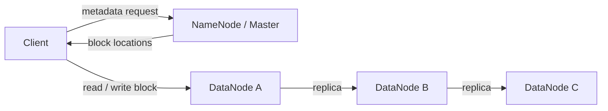
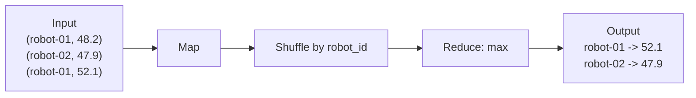
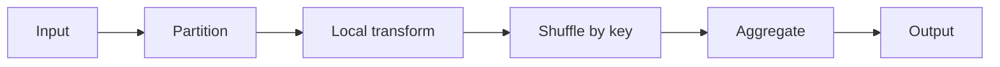
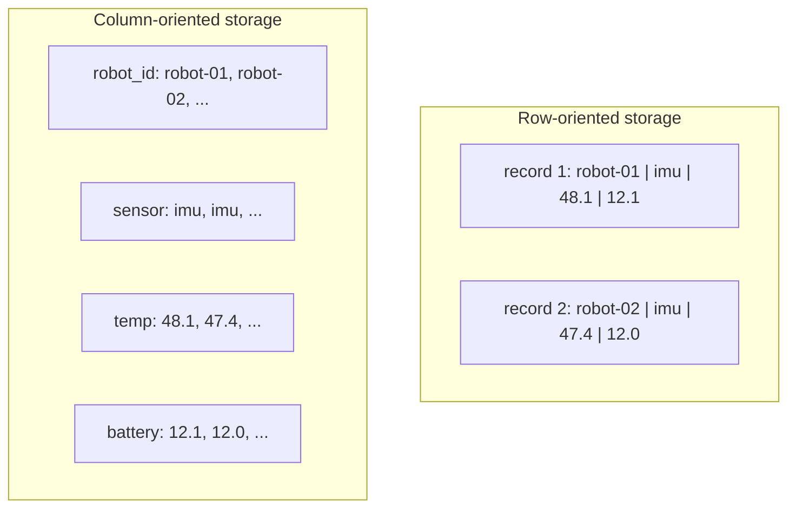
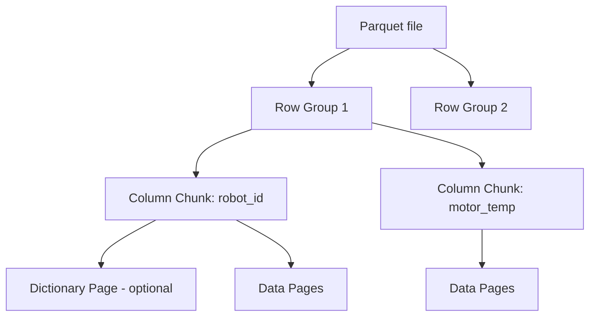
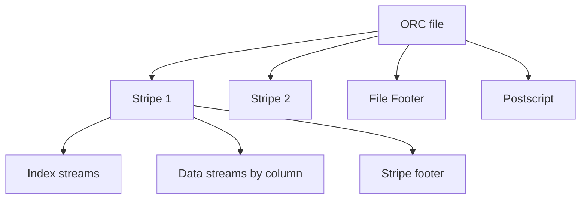
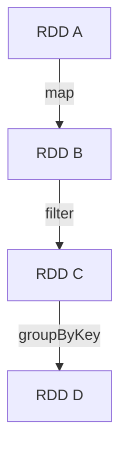
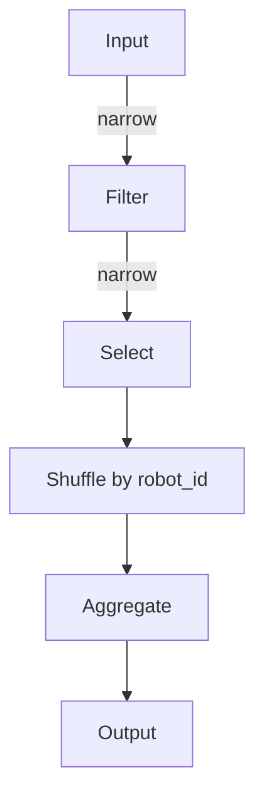
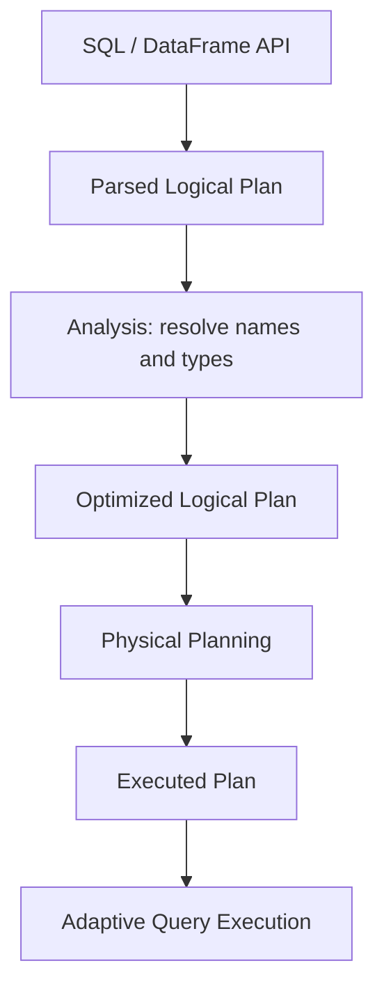

# Лекция 1. Распределённое хранение и пакетная обработка больших данных

**Дисциплина:** «Методы обработки больших данных»  
**Направление:** 44.03.05 Педагогическое образование  
**Профиль:** «Информатика и дополнительное образование (робототехника)»  
**Этапы пайплайна:** `Collect -> Store -> Process`

$$\boxed{\mathrm{Sense}\rightarrow\mathrm{Collect}\rightarrow\mathrm{Stream}\rightarrow\mathrm{Store}\rightarrow\mathrm{Process}\rightarrow\mathrm{Learn}\rightarrow\mathrm{Teach}}$$

## 1. Тема и план лекции

1. Масштаб данных, стоимость распределённой обработки и границы масштабирования.
2. Архитектурная линия `GFS -> HDFS -> MapReduce`.
3. Колоночные форматы `Parquet` и `ORC`: кодирование, сжатие, projection и predicate pushdown.
4. `Apache Spark Core`: RDD, lineage, DAG, partition, shuffle, cache.
5. `Spark SQL`: logical/physical plan, Catalyst Optimizer и Adaptive Query Execution.

После лекции студент должен уметь объяснять физический смысл `block`, `replication`, `partition`, `shuffle`, читать Spark execution plan и связывать MapReduce с современным DataFrame/Spark SQL.

---

## 2. Масштаб данных и вычислительная стоимость

Пусть робот формирует $m$ сенсорных потоков. Для потока $j$ частота равна $f_j$, размер сообщения — $s_j$ байт. Объём за время $T$:

$$V(T)=T\sum_{j=1}^{m}f_js_j.$$

Для $R$ одинаковых роботов:

$$V_R(T)=R\,V(T).$$

Пример: 20 роботов передают 200 IMU-сообщений/с по 128 байт:

$$V_{\mathrm{day}}=20\cdot200\cdot128\cdot86400\approx4.42\cdot10^{10}.$$

Получаем примерно **44,2 ГБ данных в сутки** без учёта служебных полей протокола, сериализации и резервных копий. Даже один сравнительно лёгкий сенсорный поток формирует значительный объём данных; LiDAR и видео увеличивают его на порядки.

### 2.1. Модель времени distributed job

Для $N$ записей и $P$ исполнителей:

$$T_{\mathrm{compute}}\approx\frac{N}{P}c,$$

где $c$ — средняя стоимость обработки одной записи.

Полное время выполнения распределённой задачи:

$$T_{\mathrm{job}}=T_{\mathrm{read}}+T_{\mathrm{compute}}+T_{\mathrm{shuffle}}+T_{\mathrm{write}}+T_{\mathrm{coord}}.$$

При `groupBy`, `join`, `distinct`, `orderBy` часто доминирует $T_{\mathrm{shuffle}}$.

Ускорение:

$$S(P)=\frac{T(1)}{T(P)}.$$

Эффективность:

$$E(P)=\frac{S(P)}{P}.$$

Закон Амдала (Amdahl's law):

$$S(P)=\frac{1}{(1-\alpha)+\alpha/P},$$

где $\alpha$ — доля распараллеливаемой части.

### 2.2. Энтропия и сжимаемость

Энтропия Шеннона (Shannon entropy):

$$H(X)=-\sum_i p_i\log_2p_i.$$

Повторяющиеся `robot_id`, `sensor_type`, `state` имеют сравнительно низкую энтропию и хорошо кодируются dictionary encoding и RLE. Структура данных влияет не только на удобство SQL, но и на физический размер и I/O.

---

## 3. GFS и HDFS

Google File System (GFS) сформулировала архитектуру хранения больших файлов на commodity hardware; HDFS развивает близкие идеи для Hadoop.



Файл разбивается на блоки:

$$F=B_1\cup B_2\cup\dots\cup B_k.$$

При независимой вероятности отказа одной копии $p$ и числе реплик $r$ грубая оценка вероятности одновременной потери всех копий:

$$P_{\mathrm{loss}}\approx p^r.$$

Это учебная модель: реальные отказы коррелированы, поэтому в реальных системах учитываются rack/zone failure domains.

### Data locality

Передача объёма $D$ по сети с полезной пропускной способностью $B_{\mathrm{net}}$:

$$T_{\mathrm{net}}\approx\frac{D}{B_{\mathrm{net}}}.$$

Отсюда принцип: **Move computation to data, not data to computation.**

Для архивов LiDAR/видео это означает: тяжёлые агрегаты выполняются рядом с хранилищем, а не через скачивание сырых данных на ноутбук.

---

## 4. MapReduce

Формальная модель:

$$\mathrm{map}(k_1,v_1)\rightarrow[(k_2,v_2)],$$

$$\mathrm{reduce}(k_2,[v_2])\rightarrow[v_3].$$

Пример поиска максимальной температуры двигателя:



Если функция ассоциативна и коммутативна, возможна локальная агрегация:

$$\max(\max(A),\max(B))=\max(A\cup B).$$

Главный переносимый принцип MapReduce:



Он повторяется в Spark при `groupBy`, `join`, `repartition`.

---

## 5. Parquet и ORC

### 5.1. Row vs column storage

Строковая и колоночная организации данных отличаются физическим размещением значений:



Если запрос использует только `robot_id` и `temp`, колоночный формат сокращает объём чтения.

### 5.2. Parquet

Упрощённая физическая организация Apache Parquet:



Используются dictionary encoding, RLE/bit packing, statistics, page/column indexes и codecs `Snappy`, `ZSTD`.

Коэффициент уменьшения объёма:

$$C=\frac{S_{\mathrm{raw}}}{S_{\mathrm{columnar}}}.$$

### 5.3. ORC

Упрощённая структура ORC:



ORC использует type-aware encoding, statistics и индексы по row groups.

### 5.4. Projection и predicate pushdown

```sql
SELECT robot_id, motor_temp
FROM telemetry
WHERE motor_temp > 70;
```

Projection исключает ненужные колонки. Если metadata группы содержит `min=42`, `max=55`, группа не читается при `motor_temp > 70`.

---

## 6. TF-IDF и BM25 для текстовых логов

Диагностические сообщения робототехнической системы могут выглядеть так:

```text
motor controller timeout
lidar packet dropped
navigation goal aborted
battery voltage low
```

### TF-IDF

Частота терма:

$$\mathrm{TF}(t,d)=\frac{f_{t,d}}{|d|}.$$

Обратная документная частота:

$$\mathrm{IDF}(t)=\log\frac{N}{\mathrm{df}(t)}.$$

Итоговый вес:

$$\mathrm{TFIDF}(t,d)=\mathrm{TF}(t,d)\cdot\mathrm{IDF}(t).$$

### BM25

$$\mathrm{BM25}(d,q)=\sum_{t\in q}\mathrm{IDF}(t)\cdot\frac{f(t,d)(k_1+1)}{f(t,d)+k_1\left(1-b+b\frac{|d|}{\mathrm{avgdl}}\right)}.$$

Параметр $k_1$ управляет насыщением term frequency, $b$ — нормализацией по длине документа. Для миллионов логов статистики $\mathrm{df}(t)$ и inverted index естественно требуют распределённой обработки.

---

## 7. Apache Spark Core

RDD (Resilient Distributed Dataset) — неизменяемая распределённая коллекция partition.



Lineage позволяет восстанавливать утраченную partition повторным вычислением.

**Narrow dependencies:** `map`, `filter`, `select`.  
**Wide dependencies:** `groupBy`, `join`, `distinct`, `orderBy`, `repartition`.



Wide dependency обычно создаёт shuffle и границу stage.

---

## 8. PySpark: пакетная обработка

```python
!pip -q install "pyspark==4.2.0"

from pyspark.sql import SparkSession, functions as F

spark = (
    SparkSession.builder
    .master("local[*]")
    .appName("Lecture01")
    .config("spark.sql.shuffle.partitions", "4")
    .getOrCreate()
)

telemetry = (
    spark.range(500_000)
    .withColumn(
        "robot_id",
        F.concat(F.lit("robot-"), (F.col("id") % 8).cast("string"))
    )
    .withColumn(
        "motor_temp",
        F.lit(42.0) + (F.col("id") % 100) * 0.12
    )
    .withColumn(
        "battery_v",
        F.lit(12.6) - (F.col("id") % 1000) * 0.0008
    )
    .drop("id")
)

summary = (
    telemetry
    .groupBy("robot_id")
    .agg(
        F.count("*").alias("records"),
        F.avg("motor_temp").alias("avg_temp"),
        F.max("motor_temp").alias("max_temp"),
        F.avg("battery_v").alias("avg_voltage")
    )
)

summary.show()
summary.explain(mode="formatted")
```

В physical plan требуется найти `Exchange` и объяснить его происхождение.

---

## 9. Spark SQL и Catalyst Optimizer

Обобщённая последовательность обработки SQL/DataFrame-запроса:



Типичные оптимизации: constant folding, predicate pushdown, column pruning, выбор join strategy, broadcast, coalescing post-shuffle partitions и skew optimization через AQE.

```python
telemetry.createOrReplaceTempView("telemetry")

result = spark.sql("""
SELECT
    robot_id,
    COUNT(*) AS n,
    ROUND(AVG(motor_temp), 2) AS avg_temp,
    ROUND(MAX(motor_temp), 2) AS max_temp
FROM telemetry
WHERE battery_v > 11.9
GROUP BY robot_id
ORDER BY max_temp DESC
""")

result.show()
result.explain(mode="formatted")
```

Встроенные DataFrame/SQL expressions обычно предпочтительнее произвольной Python UDF, поскольку оптимизатор лучше понимает их семантику.

---

## 10. Teach: педагогический мост

### Как объяснять

**Partition:** класс делит 10 000 карточек между группами.  
**Shuffle:** карточки одного `robot_id` после локальной работы нужно собрать вместе.  
**Columnar storage:** если нужна только температура, читается только «стопка температур».

### Типичные ошибки

1. «Больше partition всегда быстрее».
2. «Spark хранит всё только в RAM».
3. «Parquet — просто сжатый CSV».
4. «groupBy — локальная операция».
5. «HDFS обязателен для любого большого файла».

### Микрокейс для 9–11 класса / НТО

Дана телеметрия со следующими полями:

```text
timestamp, robot_id, motor_temp, battery_v, velocity, message
```

Необходимо:

1. найти максимум температуры каждого робота;
2. найти пять роботов с наибольшим падением батареи;
3. сравнить размер CSV и Parquet;
4. найти редкие диагностические сообщения;
5. указать, какая операция потребует shuffle.

**Усложнение:** один робот генерирует 50% событий. Предложить partitioning, уменьшающий skew.

---

## 11. Контрольные вопросы

1. Почему `groupBy(robot_id)` создаёт shuffle, а `filter(motor_temp > 70)` обычно нет?
2. Почему replication не защищает от всех коррелированных отказов?
3. Когда Parquet заметно выигрывает у CSV и когда выигрыш может быть мал?
4. Чем logical plan отличается от physical plan и зачем нужен AQE?
5. Как построить распределённое вычисление IDF по миллионам логов через `map -> shuffle -> reduce`?

---

## 12. Основные источники

1. Ghemawat S., Gobioff H., Leung S.-T. **The Google File System**.  
   https://research.google/pubs/the-google-file-system/
2. Dean J., Ghemawat S. **MapReduce: Simplified Data Processing on Large Clusters**.  
   https://research.google/pubs/mapreduce-simplified-data-processing-on-large-clusters/
3. Apache Spark. **Spark SQL, DataFrames and Datasets Guide**.  
   https://spark.apache.org/docs/latest/sql-programming-guide
4. Apache Spark. **Performance Tuning / Adaptive Query Execution**.  
   https://spark.apache.org/docs/latest/sql-performance-tuning
5. Apache Parquet.  
   https://parquet.apache.org/docs/
6. Apache ORC.  
   https://orc.apache.org/docs/
