# Лекция 2. Потоковые данные и распределённая обработка событий

**Дисциплина:** «Методы обработки больших данных»  
**Направление:** 44.03.05 Педагогическое образование  
**Профиль:** «Информатика и дополнительное образование (робототехника)»  
**Этапы пайплайна:** `Stream -> Process`

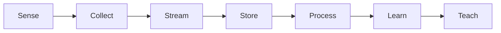

## 1. Тема и план лекции

1. Модель неограниченного потока: throughput, latency, backlog, backpressure.
2. Apache Kafka: topic, partition, offset, replication, consumer group; KRaft metadata quorum.
3. Spark Structured Streaming: unbounded table, micro-batch, state, checkpoint.
4. Event Time, Processing Time, tumbling/sliding/session windows и watermarking.
5. Apache Flink DataStream и fault tolerance stateful stream processing.

После лекции студент должен уметь проектировать поток обработки телеметрии нескольких роботов, выбирать ключ партиционирования Kafka, рассчитывать параметры окна и объяснять восстановление state после сбоя.

---

## 2. Модель потока

Пусть события поступают со средней интенсивностью $\lambda$ событий/с, система обрабатывает $\mu$ событий/с.

Для устойчивой системы:

$$\lambda<\mu.$$

Коэффициент загрузки:

$$\rho=\frac{\lambda}{\mu}.$$

При $\rho\rightarrow1$ кратковременный burst создаёт backlog и увеличивает latency.

### 2.1. Throughput

$$\mathrm{Throughput}=\frac{N_{\mathrm{events}}}{T}.$$

### 2.2. End-to-end latency

$$L=t_{\mathrm{result}}-t_{\mathrm{event}}.$$

Декомпозиция:

$$L=L_{\mathrm{network}}+L_{\mathrm{queue}}+L_{\mathrm{compute}}+L_{\mathrm{sink}}.$$

### 2.3. Закон Литтла

Для стабильной системы:

$$N=\lambda W.$$

где $N$ — среднее число событий внутри pipeline, $W$ — среднее время пребывания.

Если одновременно находятся 20 000 событий при 5 000 events/s:

$$W=\frac{20000}{5000}=4\ \mathrm{s}.$$

---

## 3. Apache Kafka

Kafka хранит события как append-only log внутри partition.

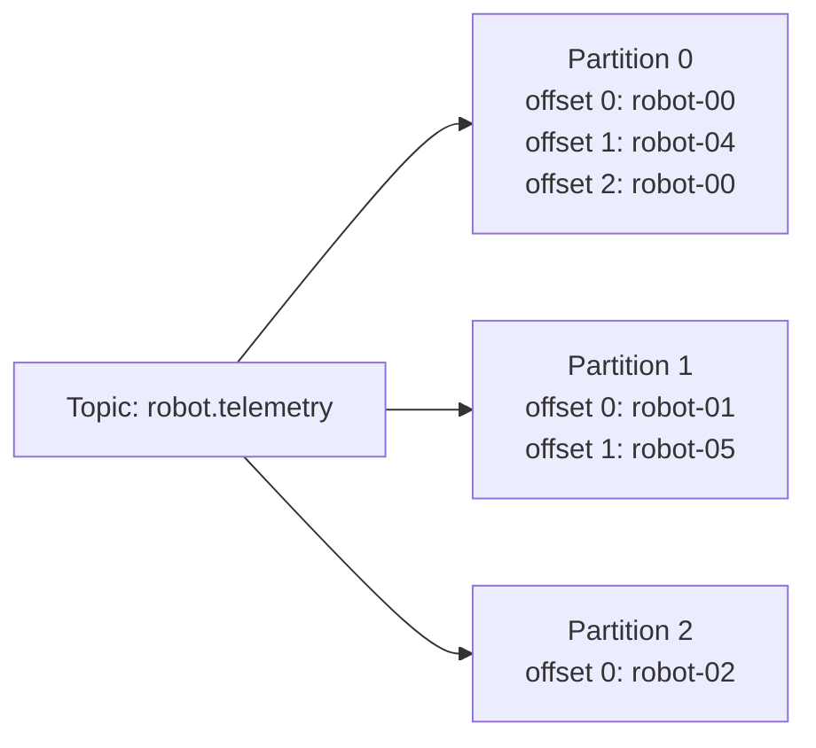

Идентификатор позиции:

$$(\mathrm{topic},\mathrm{partition},\mathrm{offset}).$$

Offset — позиция внутри partition, а не timestamp.

### 3.1. Key и ordering

Если producer использует:

```text
key = robot_id
```

события одного робота маршрутизируются детерминированно в одну partition при стабильной схеме partitioning.

Kafka задаёт порядок внутри partition, но не глобальный порядок между всеми partition.

### 3.2. Consumer group

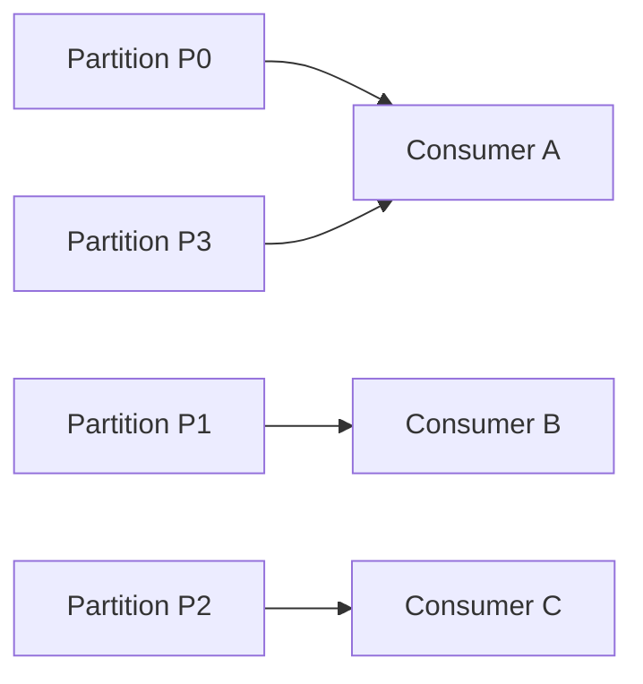

Максимальный полезный параллелизм одной consumer group ограничен числом partition:

$$P_{\mathrm{consumer}}\le P_{\mathrm{partition}}.$$

Если consumers больше, чем partition, часть consumers простаивает.

### 3.3. Replication

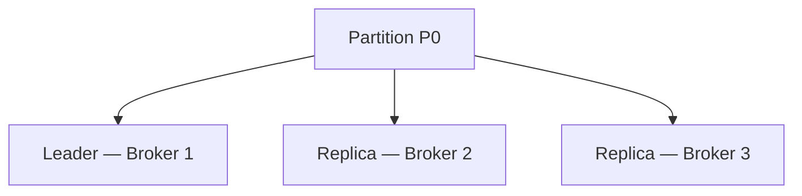

Producer/consumer работают с leader, replicas поддерживают копии. Реальная долговечность зависит от replication factor, ISR и producer acknowledgement policy.

---

## 4. KRaft

Современный Kafka использует KRaft (Kafka Raft metadata mode) вместо ZooKeeper для управления metadata quorum.

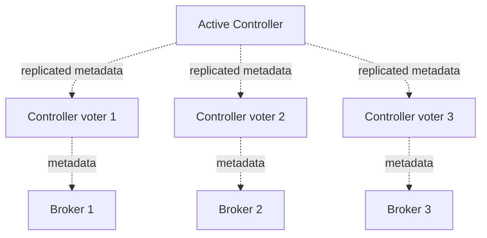

Для переносимости $f$ одновременных отказов controller quorum:

$$N_{\mathrm{controllers}}=2f+1.$$

Три controller позволяют пережить отказ одного controller при сохранении большинства.

В учебном single-node стенде roles могут объединяться; в production-критических deployment broker/controller roles рекомендуется разделять.

---

## 5. Робототехнический streaming pipeline

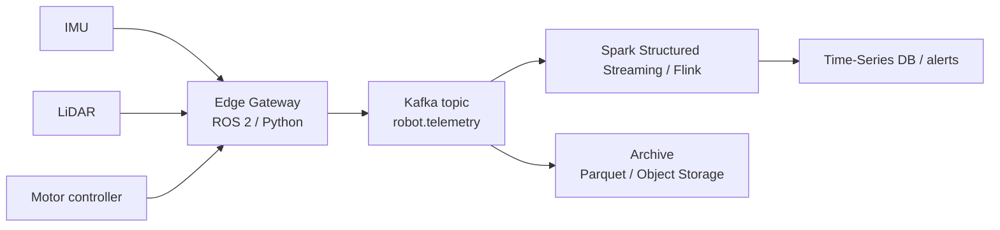

---

## 6. Event Time и Processing Time

Для сенсорного события:

- `event_time` — момент физического измерения;
- `ingestion_time` — момент поступления в stream engine;
- `processing_time` — момент обработки operator.

Пример:

```text
12:00:01.100  IMU измерил ускорение
12:00:01.120  edge сериализовал пакет
12:00:04.800  пакет пришёл по Wi-Fi
12:00:05.020  Spark обработал пакет
```

Задержка:

$$L=t_{\mathrm{processing}}-t_{\mathrm{event}}.$$

Для воспроизводимой аналитики sensor data основной временной осью обычно выбирают `event_time`.

---

## 7. Оконные алгоритмы

### 7.1. Tumbling window

Для размера $W$:

$$\mathrm{Window}_k=[kW,(k+1)W).$$

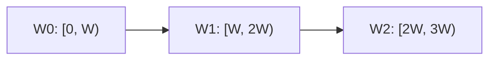

Окна не перекрываются.

### 7.2. Sliding window

Размер $W$, шаг $S$:

$$\mathrm{Window}_k=[kS,kS+W).$$

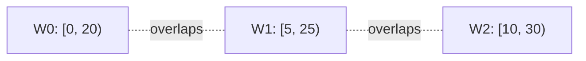

При $S<W$ запись участвует приблизительно в

$$M\approx\left\lceil\frac{W}{S}\right\rceil$$

окнах.

### 7.3. Session window

События объединяются, пока gap между ними меньше $G$:

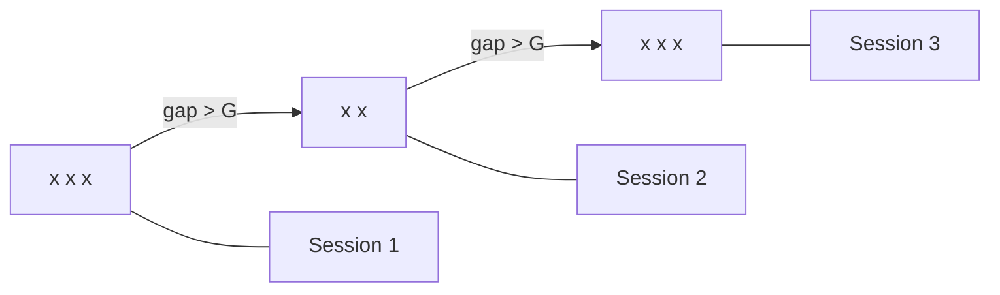

Подходит для эпизодов управления, пользовательских действий и серий команд робота.

---

## 8. Watermark

Для bounded out-of-orderness упрощённая модель:

$$\mathrm{WM}=\max(t_{\mathrm{event}})-\Delta.$$

где $\Delta$ — допустимое запаздывание.

Если максимальный observed event time равен 12:00:40, а $\Delta=10$ s:

```text
watermark ≈ 12:00:30
```

### Latency vs completeness

Большая $\Delta$:

- больше late events;
- больше state;
- более поздняя финализация.

Малая $\Delta$:

- меньше задержка;
- больше риск потерять late data.

Watermark — не команда удаления Kafka log. Это механизм прогресса event time для stateful processing.

---

## 9. Spark Structured Streaming

Spark представляет stream как неограниченную таблицу.

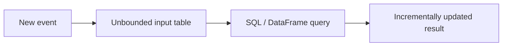

### Colab-safe пример

```python
!pip -q install "pyspark==4.2.0"

from pyspark.sql import SparkSession, functions as F
import time

spark = (
    SparkSession.builder
    .master("local[*]")
    .appName("Lecture02")
    .config("spark.sql.shuffle.partitions", "4")
    .getOrCreate()
)

source = (
    spark.readStream
    .format("rate")
    .option("rowsPerSecond", 20)
    .load()
)

telemetry = (
    source
    .withColumn(
        "robot_id",
        F.concat(F.lit("robot-"), (F.col("value") % 4).cast("string"))
    )
    .withColumnRenamed("timestamp", "event_time")
    .withColumn(
        "motor_temp",
        F.lit(45.0) + (F.col("value") % 20) * 0.5
    )
)

stats = (
    telemetry
    .withWatermark("event_time", "10 seconds")
    .groupBy(
        F.window("event_time", "20 seconds", "5 seconds"),
        "robot_id"
    )
    .agg(
        F.count("*").alias("events"),
        F.avg("motor_temp").alias("avg_temp"),
        F.max("motor_temp").alias("max_temp")
    )
)

query = (
    stats.writeStream
    .format("memory")
    .queryName("robot_stats")
    .outputMode("update")
    .trigger(processingTime="1 second")
    .start()
)

time.sleep(8)
query.processAllAvailable()
query.stop()

spark.sql("""
SELECT
    window.start,
    window.end,
    robot_id,
    events,
    ROUND(avg_temp, 2) AS avg_temp,
    max_temp
FROM robot_stats
ORDER BY start DESC, robot_id
""").show(30, truncate=False)
```

### Kafka source

```python
raw = (
    spark.readStream
    .format("kafka")
    .option("kafka.bootstrap.servers", "broker:9092")
    .option("subscribe", "robot.telemetry")
    .load()
)
```

Далее `value` декодируется из JSON/Avro/Protobuf и передаётся в тот же DataFrame pipeline.

---

## 10. Stateful processing и checkpoint

Оконный operator хранит state:

```text
(robot-01, window 12:00:00-12:00:20)
count = 318
sum_temp = ...
max_temp = ...
```

Система должна восстанавливать:

1. position/offset источника;
2. operator state;
3. согласованность sink.

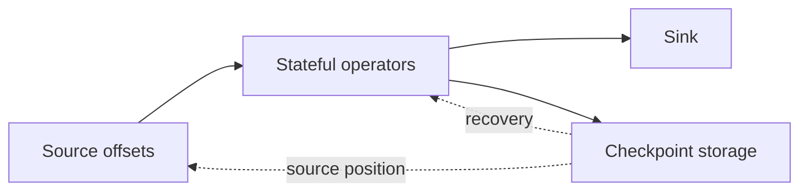

`Exactly-once` является end-to-end свойством только при совместимых source, state и sink semantics. Запись во внешнюю нетранзакционную систему может дублироваться при replay.

Идемпотентный ключ:

```text
PRIMARY KEY (robot_id, event_id)
```

позволяет безопасный `UPSERT`.

---

## 11. Apache Flink DataStream

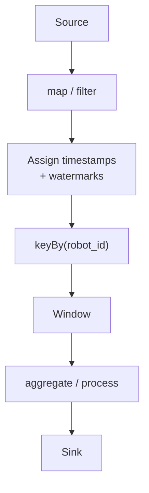

### PyFlink: bounded out-of-orderness

```python
from pyflink.common import Duration
from pyflink.common.watermark_strategy import WatermarkStrategy

wm = WatermarkStrategy.for_bounded_out_of_orderness(
    Duration.of_seconds(10)
)
```

Инварианты, общие для Spark/Flink:

```text
timestamp
key
state
window
watermark
checkpoint
sink semantics
```

---

## 12. Fault tolerance

### Broker failure

Replica может стать leader при корректной replication/ISR configuration.

### Stream worker failure

State восстанавливается из checkpoint; source чтение продолжается с согласованной позиции.

### Duplicate external effect

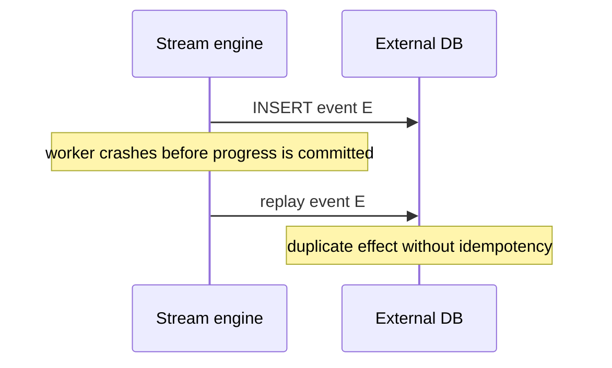

Решения:

- idempotent sink;
- transactional sink;
- deterministic event ID;
- upsert/merge.

---

## 13. Teach: педагогический мост

### Как объяснять stream

Модель «турникет»:

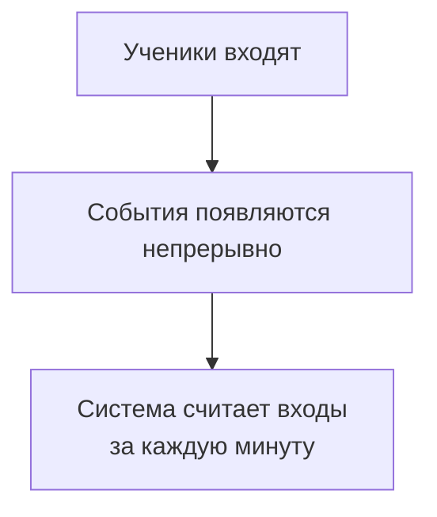

CSV — итоговая фотография; stream — расчёт «на ходу».

### Event time

> Фото сделано в 10:01, но отправлено в 10:05. Когда произошло событие?

Так вводится `event_time` без Kafka terminology.

### Типичные ошибки

1. «Kafka обрабатывает данные».
2. «Offset — timestamp».
3. «Watermark удаляет исходные события».
4. «Window size равен trigger interval».
5. «Exactly-once автоматически действует для любой БД».

### Микрокейс НТО

Дан поток:

```text
timestamp, robot_id, motor_temp
```

События задерживаются до 7 секунд. Каждые 5 секунд требуется максимум за последние 20 секунд.

При:

$$W=20,\quad S=5$$

одна запись участвует примерно в

$$\frac{20}{5}=4$$

окнах.

Учащийся должен выбрать watermark и объяснить судьбу late event.

---

## 14. Контрольные вопросы

1. Почему порядок Kafka ограничен partition?
2. Как key=`robot_id` влияет на ordering, parallelism и skew?
3. Почему event time важнее processing time для воспроизводимого sensor analytics?
4. Что произойдёт со state при бесконечном потоке без watermark?
5. Почему end-to-end exactly-once нельзя утверждать без анализа sink?

---

## 15. Основные источники

1. Apache Kafka. **KRaft**.  
   https://kafka.apache.org/42/operations/kraft/
2. Apache Spark. **Structured Streaming**.  
   https://spark.apache.org/docs/latest/streaming/
3. Apache Flink. **Streaming Analytics**.  
   https://nightlies.apache.org/flink/flink-docs-stable/docs/learn-flink/streaming_analytics/
4. Apache Flink. **Generating Watermarks**.  
   https://nightlies.apache.org/flink/flink-docs-stable/docs/dev/datastream/event-time/generating_watermarks/
5. Apache Flink. **Windows**.  
   https://nightlies.apache.org/flink/flink-docs-stable/docs/dev/datastream-v2/builtin-funcs/windows/
