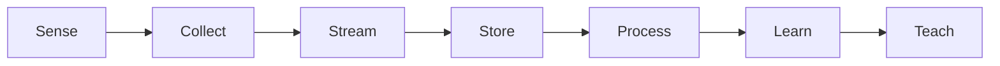
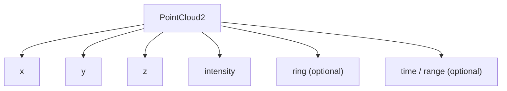
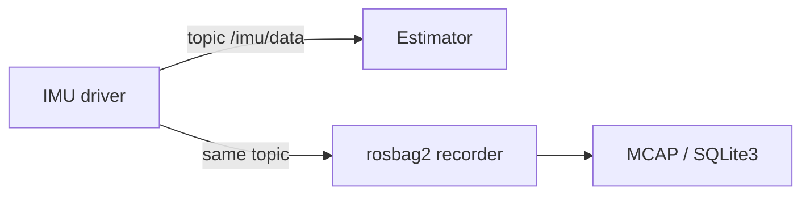
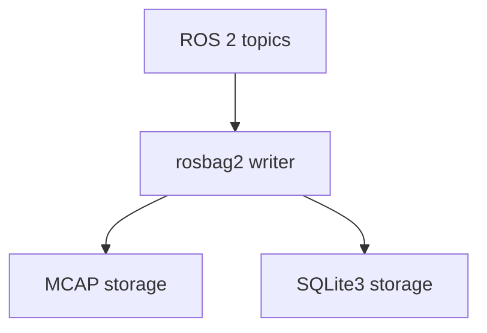
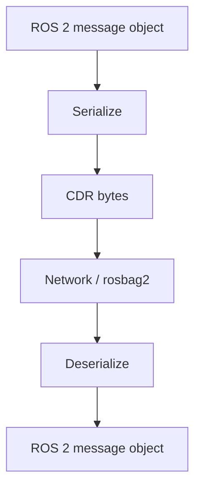
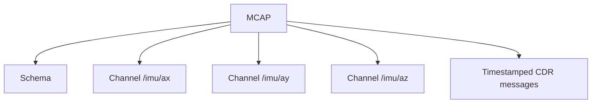
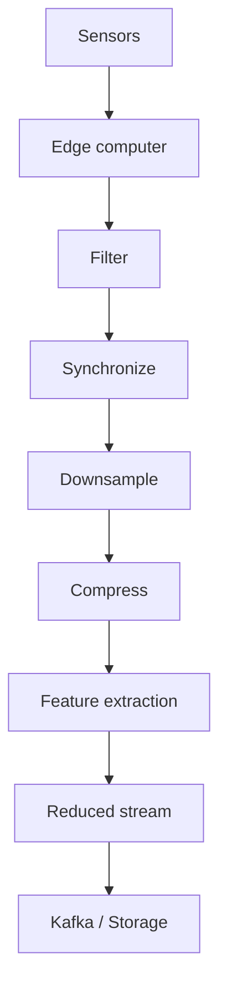
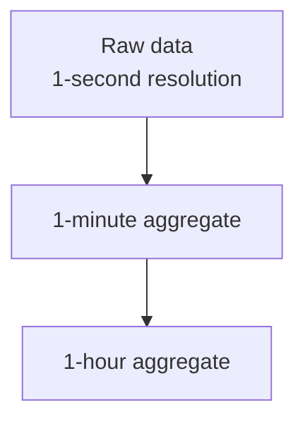
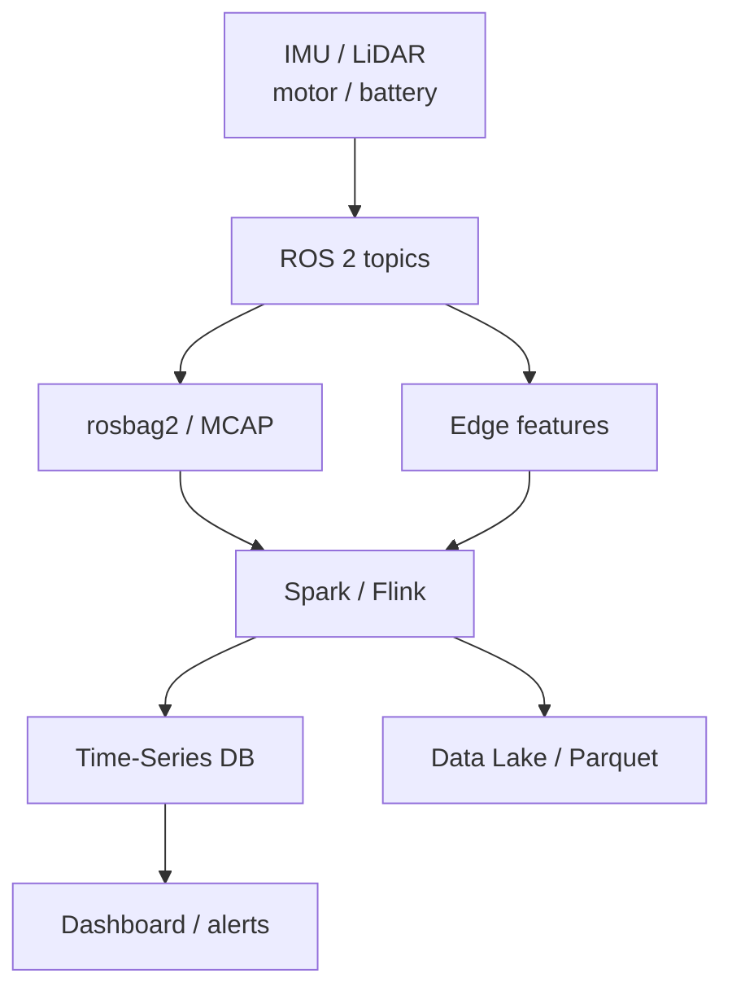
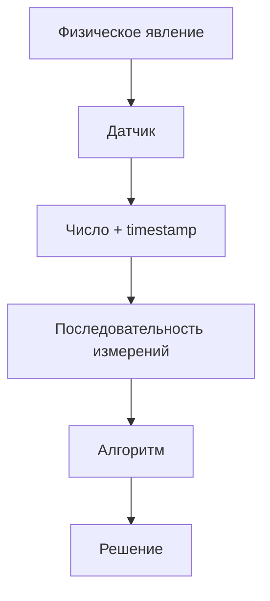

# Лекция 3. Большие данные робототехнических и IoT-систем

**Дисциплина:** «Методы обработки больших данных»  
**Направление:** 44.03.05 Педагогическое образование  
**Профиль:** «Информатика и дополнительное образование (робототехника)»  
**Этапы пайплайна:** `Sense -> Collect -> Store -> Process`



## 1. Тема и план лекции

1. Сенсорные потоки робота: IMU, LiDAR, камеры, одометрия и оценка объёма данных.
2. ROS 2 topics и журналирование: rosbag2, MCAP/SQLite, CDR serialization.
3. Извлечение ROS 2 данных через Python без установленного ROS.
4. Edge Computing, downsampling, feature extraction и Time-Series БД.
5. Статистическая обработка: RMS, Z-score, энтропия окна и обнаружение аномалий.

После лекции студент должен уметь оценивать sensor data rate, различать ROS message/topic/bag storage, извлекать сообщения из rosbag2/MCAP и проектировать pipeline `raw sensors -> edge features -> time-series analytics`.

---

## 2. Sensor data rate

Для сенсора с частотой $f$ и размером измерения $s$:

$$R=f\,s.$$

Для $m$ сенсоров:

$$R_{\mathrm{robot}}=\sum_{i=1}^{m}f_i s_i.$$

За время $T$:

$$V=R_{\mathrm{robot}}T.$$

### Пример IMU

Пусть:

```text
200 Hz
6 float32 значений
```

Минимальный payload:

$$200\cdot6\cdot4=4800\ \mathrm{bytes/s}.$$

Практический ROS 2 message также содержит header, timestamps, covariance и serialization overhead.

### Пример LiDAR

Point cloud:

$$\mathcal{P}=\{(x_i,y_i,z_i,I_i)\}_{i=1}^{N}.$$

Для $N=100000$ точек, четырёх `float32`:

$$S_{\mathrm{frame}}\approx100000\cdot4\cdot4=1.6\ \mathrm{MB}.$$

При 10 Hz:

$$R\approx16\ \mathrm{MB/s}.$$

Это ещё без metadata и возможных дополнительных полей.

---

## 3. Основные сенсорные представления

### 3.1. IMU

Ускорение:

$$\mathbf{a}=[a_x,a_y,a_z]^T.$$

Угловая скорость:

$$\boldsymbol{\omega}=[\omega_x,\omega_y,\omega_z]^T.$$

Норма ускорения:

$$\lVert\mathbf{a}\rVert_2=\sqrt{a_x^2+a_y^2+a_z^2}.$$

Для неподвижного IMU модуль близок к $g$, но ориентация распределяет компоненты по осям.

### 3.2. LiDAR



Big Data задача возникает из сочетания:

- большого числа точек;
- высокой частоты;
- нескольких роботов;
- длительного времени записи.

### 3.3. Одометрия

Положение:

$$\mathbf{p}_t=[x_t,y_t,z_t]^T.$$

Пройденный путь:

$$D=\sum_{t=1}^{n-1}\lVert\mathbf{p}_{t+1}-\mathbf{p}_t\rVert_2.$$

---

## 4. ROS 2 как транспорт данных



Topic — логический канал сообщений определённого типа.

Примеры:

```text
/sensors/imu       sensor_msgs/msg/Imu
/lidar/points      sensor_msgs/msg/PointCloud2
/odom              nav_msgs/msg/Odometry
```

---

## 5. rosbag2

rosbag2 разделяет:

- storage plugin;
- serialization format;
- message schema;
- timestamped messages.

Текущий rosbag2 repository предоставляет storage plugins `mcap` и `sqlite3`; в rolling MCAP используется как default storage plugin.



### MCAP

Логические сущности:

```text
Schema
Channel
Message
Metadata
Indexes
Chunks
```

Пример:

```text
Schema:
  sensor_msgs/Imu

Channel:
  /imu/data
  message_encoding = cdr

Message:
  log_time
  publish_time
  raw CDR payload
```

---

## 6. CDR serialization

ROS 2 обычно использует CDR (Common Data Representation) в DDS-стеке.



Нужно различать:

- схему;
- сериализованный payload;
- timestamp;
- topic/channel metadata.

Это критично при анализе bag вне ROS environment.

---

## 7. Чтение rosbag без ROS

`rosbags` — pure Python библиотека для rosbag1/rosbag2, не требующая установленного ROS software stack.

```python
!pip -q install rosbags pandas pyarrow
```

### `AnyReader`

```python
from pathlib import Path

from rosbags.highlevel import AnyReader
import pandas as pd

bag_path = Path("/content/my_rosbag")

rows = []

with AnyReader([bag_path]) as reader:
    connections = [
        c for c in reader.connections
        if c.topic == "/imu/data"
    ]

    for connection, timestamp, rawdata in reader.messages(
        connections=connections
    ):
        msg = reader.deserialize(
            rawdata,
            connection.msgtype
        )

        rows.append({
            "timestamp_ns": timestamp,
            "ax": msg.linear_acceleration.x,
            "ay": msg.linear_acceleration.y,
            "az": msg.linear_acceleration.z,
            "wx": msg.angular_velocity.x,
            "wy": msg.angular_velocity.y,
            "wz": msg.angular_velocity.z,
        })

imu = pd.DataFrame(rows)

imu["accel_norm"] = (
    imu["ax"] ** 2 +
    imu["ay"] ** 2 +
    imu["az"] ** 2
) ** 0.5

imu.head()
```

Для custom message type требуется зарегистрировать соответствующее `.msg`/IDL определение в typestore.

---

## 8. MCAP Python tooling без ROS

```python
!pip -q install mcap mcap-ros2-support
```

Foxglove MCAP Python tooling поддерживает ROS 2 schema/encoding вне ROS 2 environment.



Для Google Colab это важный архитектурный приём: bag становится обычным входным data artifact, а не причиной разворачивать полноценную middleware-инфраструктуру.

---

## 9. Синхронизация сенсоров

Пусть IMU измеряется в моменты:

$$t_i^{\mathrm{IMU}}.$$

а LiDAR:

$$t_j^{\mathrm{LiDAR}}.$$

Простейшее nearest-neighbor сопоставление:

$$j^*=\arg\min_j\left|t_i^{\mathrm{IMU}}-t_j^{\mathrm{LiDAR}}\right|.$$

Допустимая ошибка синхронизации:

$$\left|t_i^{\mathrm{IMU}}-t_{j^*}^{\mathrm{LiDAR}}\right|\le\varepsilon.$$

Если $\varepsilon$ слишком велико, объединённый sample может описывать физически разные состояния робота.

---

## 10. Edge Computing

Передавать все raw sensor data в центральную систему не всегда возможно.



### 10.1. Снижение трафика

$$K_{\mathrm{edge}}=\frac{R_{\mathrm{raw}}}{R_{\mathrm{out}}}.$$

Если исходный поток 80 MB/s, а после edge preprocessing — 2 MB/s:

$$K_{\mathrm{edge}}=40.$$

### 10.2. Downsampling

Для коэффициента $M$:

$$f_{\mathrm{out}}=\frac{f_{\mathrm{in}}}{M}.$$

Перед decimation требуется low-pass filtering, иначе появляется aliasing.

Критерий Найквиста:

$$f_s>2f_{\mathrm{max}}.$$

Для курса важен инженерный вывод: уменьшение частоты нельзя выполнять только ради экономии места, не исследовав содержимое сигнала.

---

## 11. Time-Series database

Типичная схема:

```text
timestamp
robot_id
sensor
value
quality
```

Time-series workload характеризуется:

- append-heavy ingestion;
- range queries по времени;
- агрегатами по time buckets;
- retention/downsampling.

### TimescaleDB

```sql
CREATE TABLE telemetry (
    ts          TIMESTAMPTZ NOT NULL,
    robot_id    TEXT        NOT NULL,
    motor_temp  DOUBLE PRECISION,
    vibration   DOUBLE PRECISION
);
```

Агрегирование:

```sql
SELECT
    time_bucket('1 minute', ts) AS bucket,
    robot_id,
    AVG(motor_temp) AS avg_temp,
    MAX(motor_temp) AS max_temp
FROM telemetry
GROUP BY bucket, robot_id
ORDER BY bucket, robot_id;
```

Continuous aggregate хранит инкрементально обновляемые временные агрегаты.



---

## 12. RMS

Для вибрации:

$$\mathrm{RMS}=\sqrt{\frac{1}{N}\sum_{i=1}^{N}x_i^2}.$$

RMS измеряет среднеквадратичный уровень и не уничтожает энергию сигнала из-за смены знака.

```python
import numpy as np

window = np.array([0.10, 0.12, 0.11, 0.75, 0.70])

rms = np.sqrt(np.mean(window ** 2))
print(rms)
```

---

## 13. Z-score

$$z_i=\frac{x_i-\mu}{\sigma}.$$

Учебное правило:

$$\lvert z_i\rvert\ge3\Rightarrow\mathrm{candidate\ anomaly}.$$

Ограничения:

- drift;
- нестационарность;
- multimodal distribution;
- выбросы искажают $\mu$ и $\sigma$.

Z-score не является «детектором неисправности» сам по себе; он выделяет статистически необычные точки относительно выбранного baseline.

---

## 14. Энтропия сенсорного окна

Для дискретизированных состояний:

$$H(X)=-\sum_i p_i\log_2p_i.$$

Feature vector окна:

$$\mathbf{z}=[\mu,\sigma,\mathrm{RMS},\min,\max,H]^T.$$

Энтропия может изменяться при смене динамического режима, но должна интерпретироваться вместе с физическими признаками.

---

## 15. Скользящая статистика

Среднее на последних $N$ измерениях:

$$\bar{x}_t=\frac{1}{N}\sum_{i=t-N+1}^{t}x_i.$$

RMS:

$$\mathrm{RMS}_t=\sqrt{\frac{1}{N}\sum_{i=t-N+1}^{t}x_i^2}.$$

Rolling Z-score:

$$z_t=\frac{x_t-\mu_t}{\sigma_t}.$$

---

## 16. PySpark-анализ временного ряда

```python
!pip -q install "pyspark==4.2.0"

from pyspark.sql import SparkSession, functions as F, Window

spark = (
    SparkSession.builder
    .master("local[*]")
    .appName("Lecture03")
    .getOrCreate()
)

data = [
    ("robot-01", 1, 45.0, 0.20),
    ("robot-01", 2, 45.2, 0.21),
    ("robot-01", 3, 45.1, 0.19),
    ("robot-01", 4, 58.0, 0.80),
    ("robot-01", 5, 59.5, 0.84),
]

df = spark.createDataFrame(
    data,
    ["robot_id", "t", "temperature", "vibration"]
)

w = (
    Window
    .partitionBy("robot_id")
    .orderBy("t")
    .rowsBetween(-2, 0)
)

result = (
    df
    .withColumn(
        "vibration_rms",
        F.sqrt(
            F.avg(F.pow("vibration", 2)).over(w)
        )
    )
    .withColumn(
        "temp_mean_3",
        F.avg("temperature").over(w)
    )
)

result.show()
```

---

## 17. Архитектура мониторинга



---

## 18. Teach: педагогический мост

### Как объяснять sensor data

Использовать смартфон как знакомый объект:



### Типичные ошибки

1. «Чем выше частота, тем всегда лучше».
2. «Timestamp разных сенсоров одинаково точен».
3. «Любой выброс означает неисправность».
4. «RMS — обычное среднее».
5. «Edge заменяет cloud».

### Школьный микрокейс

**Проект:** «Определение удара мобильного робота по акселерометру».

Дано:

```text
timestamp, ax, ay, az
```

Рассчитать:

$$a=\sqrt{a_x^2+a_y^2+a_z^2}.$$

затем rolling RMS и threshold.

Необходимо:

1. выделить интервалы удара;
2. построить график;
3. объяснить false positive;
4. предложить дополнительный sensor feature.

**НТО-усложнение:** объединить IMU и ток двигателя; тревогу считать достоверной только при согласованном изменении нескольких признаков.

---

## 19. Контрольные вопросы

1. Почему частота датчика влияет одновременно на storage, network и compute requirements?
2. Чем ROS message object отличается от CDR payload, topic и storage format?
3. Какие преимущества и ограничения даёт анализ rosbag без установленного ROS?
4. Почему downsampling без фильтрации может изменить физический смысл сигнала?
5. Чем RMS, Z-score и энтропия описывают разные свойства sensor time series?

---

## 20. Основные источники

1. ROS 2. **rosbag2**.  
   https://github.com/ros2/rosbag2
2. ROS 2. **MCAP storage plugin**.  
   https://github.com/ros2/rosbag2/tree/rolling/rosbag2_storage_mcap
3. Ternaris. **Rosbags documentation**.  
   https://ternaris.gitlab.io/rosbags/
4. Foxglove. **MCAP**.  
   https://github.com/foxglove/mcap
5. Timescale. **Continuous aggregates**.  
   https://docs.timescale.com/use-timescale/latest/continuous-aggregates/about-continuous-aggregates/
