# Лекция 3. Большие данные робототехнических и IoT-систем

**Дисциплина:** «Методы обработки больших данных»  
**Направление:** 44.03.05 Педагогическое образование  
**Профиль:** «Информатика и дополнительное образование (робототехника)»  
**Этапы пайплайна:** `Sense -> Collect -> Stream -> Store -> Process -> Learn -> Teach`

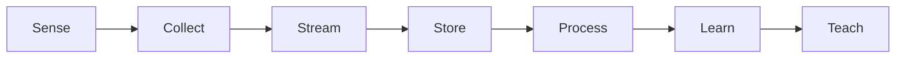
```mermaid
flowchart LR
    S0["Sense"]
    S1["Collect"]
    S2["Stream"]
    S3["Store"]
    S4["Process"]
    S5["Learn"]
    S6["Teach"]
    S0 --> S1
    S1 --> S2
    S2 --> S3
    S3 --> S4
    S4 --> S5
    S5 --> S6
```

### Как читать этот пайплайн

**Пайплайн (pipeline)** — это последовательность этапов, через которые проходят данные: от момента возникновения измерения до решения или учебного вывода.

| Этап | По-русски | Что происходит | Простой пример |
|---|---|---|---|
| `Sense` | Измерить | датчик получает физический сигнал | IMU измеряет ускорение |
| `Collect` | Собрать | контроллер/ROS принимает сообщения | сообщения приходят в ROS 2 topic |
| `Stream` | Передать потоком | данные идут непрерывно по мере появления | температура двигателя приходит 10 раз в секунду |
| `Store` | Сохранить | данные пишутся в файл или БД | `rosbag2`, MCAP, TimescaleDB |
| `Process` | Обработать | данные фильтруются, агрегируются и анализируются | вычисляется RMS вибрации |
| `Learn` | Обучить/выявить закономерность | накопленные данные используются для ML/аналитики | модель учится отличать норму от аномалии |
| `Teach` | Объяснить и использовать | результат превращается в понятное правило, визуализацию или учебный кейс | студент объясняет причину тревоги |

> **Главная идея:** большие данные в робототехнике — это не только «очень большой файл». Это задача управления **непрерывным потоком разнородных данных**, которые нужно вовремя принять, синхронизировать, сохранить, обработать и превратить в полезное решение.

## 1. Тема и план лекции

1. Сенсорные потоки робота: IMU, LiDAR, камеры, одометрия и оценка объёма данных.
2. ROS 2 topics и журналирование: rosbag2, MCAP/SQLite, CDR serialization.
3. Извлечение ROS 2 данных через Python без установленного ROS.
4. Edge Computing, downsampling, feature extraction и Time-Series БД.
5. Статистическая обработка: RMS, Z-score, энтропия окна и обнаружение аномалий.

После лекции студент должен уметь оценивать скорость сенсорного потока (sensor data rate), различать сообщение ROS, topic и формат хранения bag-файла, извлекать сообщения из rosbag2/MCAP и проектировать цепочку `raw sensors -> edge features -> time-series analytics`.

### Что здесь означает Big Data

Для робототехники полезно объяснять Big Data через модель **5V**:

| Характеристика | Смысл | Пример в робототехнике |
|---|---|---|
| **Volume — объём** | данных много | камеры и LiDAR создают гигабайты записей |
| **Velocity — скорость** | данные поступают быстро и непрерывно | IMU может выдавать сотни измерений в секунду |
| **Variety — разнообразие** | форматы и смысл данных различаются | изображения, облака точек, координаты, ток двигателя |
| **Veracity — достоверность** | данные содержат шум, пропуски и ошибки времени | потерянные пакеты, дрейф датчика, неверный timestamp |
| **Value — ценность** | данные должны приводить к полезному результату | обнаружение износа, оптимизация маршрута, обучение модели |

Один короткий эксперимент с одним датчиком ещё не обязательно является Big Data. Задача становится «большой», когда растут **число роботов, частота датчиков, длительность работы и сложность совместного анализа**.

### Современное состояние: как большие данные используются в робототехнике в 2026 году

В современной робототехнической системе данные обычно используются сразу в нескольких контурах:

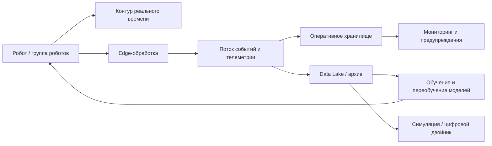
```mermaid
flowchart LR
    R["Робот / группа роботов"] --> RT["Контур реального времени"]
    R --> EDGE["Edge-обработка"]
    EDGE --> STREAM["Поток событий и телеметрии"]
    STREAM --> HOT["Оперативное хранилище"]
    STREAM --> LAKE["Data Lake / архив"]
    HOT --> MON["Мониторинг и предупреждения"]
    LAKE --> ML["Обучение и переобучение моделей"]
    LAKE --> DT["Симуляция / цифровой двойник"]
    ML --> R
```

Это означает, что **одни и те же данные имеют несколько жизней**:

1. **Миллисекунды–секунды:** робот использует данные для управления и безопасности.
2. **Секунды–минуты:** потоковая аналитика ищет перегрев, вибрацию, потерю связи и другие события.
3. **Часы–дни:** инженеры анализируют историю смены или миссии.
4. **Недели–месяцы:** накопленные данные используются для обучения моделей, оптимизации парка роботов и сравнения версий алгоритмов.
5. **Отдельный контур:** реальные данные могут использоваться вместе с симуляцией и синтетическими данными для проверки алгоритмов.

По состоянию на 2026 год эта архитектура хорошо видна в развитии нескольких экосистем.

**Масштаб отрасли тоже объясняет, почему Big Data становится практической необходимостью.** По данным International Federation of Robotics (IFR), в 2025 году мировой парк действующих промышленных роботов превысил 5 млн единиц, а годовые установки впервые превысили 600 тыс. роботов [14]. Для профессиональных сервисных роботов IFR отдельно отмечает сильный рост и ведущую роль транспортно-логистических применений [15]. Чем больше парк, тем больше накапливается телеметрии, журналов миссий, событий обслуживания и данных для оптимизации.

IFR относит к ключевым тенденциям робототехники 2026 года рост AI/автономности и сближение **IT (Information Technology — информационные технологии)** с **OT (Operational Technology — технологии управления физическим оборудованием)** [13]. Для курса по большим данным это принципиально: данные больше не остаются внутри отдельного контроллера — они связывают физический робот, локальные вычисления, корпоративную аналитику и модели AI.

- ROS 2 остаётся транспортной основой множества робототехнических проектов, а `rosbag2` поддерживает MCAP и SQLite3; MCAP является форматом хранения по умолчанию в текущей ветке `rosbag2` [1–3].
- Open-RMF (Robotics Middleware Framework) развивается как платформа координации **нескольких роботов и нескольких парков роботов**, где данные нужны уже не только для одного устройства, но и для диспетчеризации, маршрутизации и совместного использования ресурсов [8].
- Современные симуляторы, например NVIDIA Isaac Sim, используют физическое моделирование, ROS 2-интеграцию и **Synthetic Data Generation (SDG — генерацию синтетических данных)** для обучения и проверки робототехнических систем [9, 10].
- Потоковые системы используют **event time** — время, когда событие реально произошло на устройстве, и **watermark** — служебную границу, помогающую понять, насколько далеко продвинулся поток при наличии запаздывающих сообщений [7].
- Apache Spark 4.2.0, выпущенный 14 июля 2026 года, остаётся актуальным инструментом массовой обработки DataFrame/SQL-нагрузок; для учебной лаборатории PySpark позволяет показать те же идеи распределённой аналитики даже на одной машине [6].

### Где Big Data реально даёт пользу роботу

| Задача | Какие данные нужны | Что получаем |
|---|---|---|
| Предиктивное обслуживание | вибрация, температура, ток, ошибки | раннее обнаружение ухудшения состояния |
| Анализ миссий | позиции, скорости, команды, события | поиск неэффективных маршрутов и остановок |
| Управление флотом | состояния многих роботов | распределение заданий и ресурсов |
| Безопасность | телеметрия + события + журнал ошибок | расследование инцидентов и поиск повторяющихся причин |
| Обучение ML-моделей | большие размеченные наборы сенсорных данных | распознавание объектов, аномалий, режимов |
| Цифровой двойник | реальные + симулированные данные | проверка сценариев без риска для оборудования |
| Образование | понятные фрагменты реальных потоков | связь физики датчика, кода и анализа данных |

> **Для бакалавра важно:** ценность Big Data возникает не из размера массива как такового, а из возможности **сопоставить данные во времени, быстро обнаружить событие и накопить историю для последующего анализа**.

---

## 2. Скорость потока данных сенсора (Sensor Data Rate)

Для сенсора с частотой $f$ и размером одного измерения $s$:

$$R=f\,s.$$

Здесь:

- $f$ — **частота измерений**, обычно в герцах (**Hz, hertz — герц**), то есть число измерений в секунду;
- $s$ — размер одного измерения в байтах;
- $R$ — скорость появления данных, например в `bytes/s`, `KB/s` или `MB/s`.

**Data rate** — это ответ на вопрос: «Сколько данных в секунду производит датчик?». Это одна из первых величин, которую инженер оценивает перед выбором сети, накопителя и способа обработки.

Для $m$ сенсоров:

$$R_{\mathrm{robot}}=\sum_{i=1}^{m}f_i s_i.$$

За время $T$:

$$V=R_{\mathrm{robot}}T.$$

### Пример IMU — инерциального измерительного модуля

Пусть:

```text
200 Hz
6 float32 значений
```

Минимальная **полезная нагрузка (payload)**:

$$200\cdot6\cdot4=4800\ \mathrm{bytes/s}.$$

Здесь `float32` — 32-битное число с плавающей точкой; оно занимает 4 байта.

Полученные 4800 байт/с — только значения шести физических величин. Практическое сообщение ROS 2 также содержит:

- **header** — служебный заголовок;
- **timestamp** — отметку времени;
- **covariance** — оценку неопределённости измерений;
- **serialization overhead** — дополнительные байты, появляющиеся при упаковке структуры сообщения для передачи/хранения.

Поэтому реальный трафик всегда немного больше «чистой» полезной нагрузки.

### Пример LiDAR — лазерного дальномера

**Point cloud (облако точек)** — это набор пространственных точек, которыми LiDAR описывает окружающие поверхности.

$$\mathcal{P}=\{(x_i,y_i,z_i,I_i)\}_{i=1}^{N}.$$

Для каждой точки обычно хранятся координаты $x,y,z$, а также $I$ — **intensity**, то есть интенсивность отражённого лазерного сигнала. Облако точек можно представить как «трёхмерную фотографию», состоящую не из пикселей, а из точек в пространстве.

Для $N=100000$ точек, четырёх `float32`:

$$S_{\mathrm{frame}}\approx100000\cdot4\cdot4=1.6\ \mathrm{MB}.$$

При 10 Hz:

$$R\approx16\ \mathrm{MB/s}.$$

Это ещё без metadata и возможных дополнительных полей.

---

## 3. Основные сенсорные представления

Прежде чем обрабатывать поток, нужно понимать **физический смысл** каждого типа данных. Алгоритм может математически корректно обработать столбец чисел и при этом дать бессмысленный инженерный результат, если неверно интерпретирован датчик.

### 3.1. IMU

**IMU (Inertial Measurement Unit — инерциальный измерительный модуль)** обычно объединяет акселерометр и гироскоп, а иногда также магнитометр. Акселерометр оценивает линейное ускорение, гироскоп — угловую скорость.

Ускорение:

$$\mathbf{a}=[a_x,a_y,a_z]^T.$$

Угловая скорость:

$$\boldsymbol{\omega}=[\omega_x,\omega_y,\omega_z]^T.$$

Норма ускорения:

$$\lVert\mathbf{a}\rVert_2=\sqrt{a_x^2+a_y^2+a_z^2}.$$

Для неподвижного IMU модуль близок к $g$, но ориентация распределяет компоненты по осям.

### 3.2. LiDAR

**LiDAR (Light Detection and Ranging — лазерное обнаружение и измерение расстояния)** посылает лазерные импульсы и по времени/характеристикам отражения оценивает расстояния до объектов. Результат часто передаётся как сообщение `PointCloud2`, содержащее облако точек.

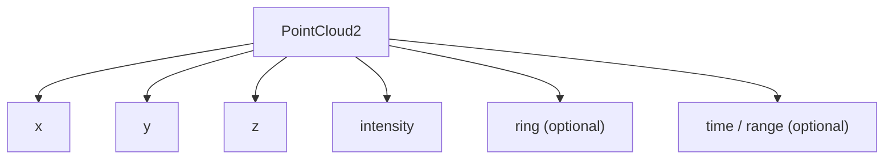
```mermaid
flowchart TD
    PC["PointCloud2"] --> X["x"]
    PC --> Y["y"]
    PC --> Z["z"]
    PC --> I["intensity"]
    PC --> R["ring (optional)"]
    PC --> T["time / range (optional)"]
```

Big Data задача возникает из сочетания:

- большого числа точек;
- высокой частоты;
- нескольких роботов;
- длительного времени записи.

### 3.3. Одометрия

**Одометрия (odometry)** — оценка положения и движения робота во времени на основе колёсных энкодеров, IMU, визуальных или других данных. Это не обязательно «абсолютно истинная координата»: оценка может постепенно накапливать ошибку, то есть **дрейфовать**.

Положение:

$$\mathbf{p}_t=[x_t,y_t,z_t]^T.$$

Пройденный путь:

$$D=\sum_{t=1}^{n-1}\lVert\mathbf{p}_{t+1}-\mathbf{p}_t\rVert_2.$$

---

## 4. ROS 2 как транспорт данных

**ROS 2 (Robot Operating System 2)** — не операционная система в обычном смысле, а набор библиотек, инструментов и соглашений для построения распределённых робототехнических приложений.

Полезная модель для начинающего:

- **node (узел)** — отдельный программный компонент, например драйвер IMU;
- **publisher (издатель)** — компонент, который публикует сообщения;
- **subscriber (подписчик)** — компонент, который получает сообщения;
- **topic (топик)** — именованный логический канал;
- **message (сообщение)** — структура данных определённого типа.

Пример: драйвер IMU публикует `sensor_msgs/msg/Imu` в топик `/imu/data`, а алгоритм оценки положения и `rosbag2` могут одновременно быть подписчиками.

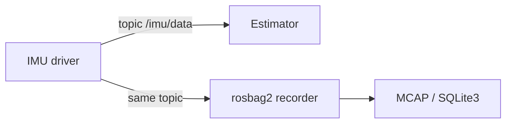
```mermaid
flowchart LR
    IMU["IMU driver"] -->|topic /imu/data| EST["Estimator"]
    IMU -->|same topic| BAG["rosbag2 recorder"]
    BAG --> MCAP["MCAP / SQLite3"]
```

**Topic (топик)** — логический канал сообщений определённого типа. Он не является файлом и не обязан хранить историю: это прежде всего механизм обмена данными между компонентами.

ROS 2 обычно использует слой **middleware (промежуточного программного обеспечения)**. Наиболее распространённая основа — **DDS (Data Distribution Service)** и протокол DDSI-RTPS; ROS 2 также поддерживает другие RMW-реализации. Middleware решает задачи обнаружения участников сети, доставки сообщений и параметров качества связи [1].

**QoS (Quality of Service — качество обслуживания)** — набор политик доставки сообщений. Упрощённо QoS отвечает на вопросы: «Нужно ли пытаться доставить каждое сообщение? Сколько старых сообщений хранить? Что делать при временном разрыве связи?». Для высокочастотного LiDAR иногда важнее свежесть, чем доставка каждого старого кадра; для управляющей команды требования могут быть другими.

Примеры:

```text
/sensors/imu       sensor_msgs/msg/Imu
/lidar/points      sensor_msgs/msg/PointCloud2
/odom              nav_msgs/msg/Odometry
```

---

## 5. rosbag2

**rosbag2** — подсистема ROS 2 для записи и последующего воспроизведения потоков сообщений. Аналогия для студента: это «регистратор полёта» робота. Он позволяет повторно исследовать эксперимент, не запуская физического робота заново.

Важно различать:

- **bag** — логическая запись эксперимента/миссии;
- **storage format** — физический формат хранения;
- **message schema** — описание структуры сообщения;
- **serialization format** — способ превратить поля сообщения в последовательность байтов.

rosbag2 разделяет:

- storage plugin;
- serialization format;
- message schema;
- timestamped messages.

Текущий rosbag2 repository предоставляет storage plugins `mcap` и `sqlite3`; в rolling MCAP используется как default storage plugin.

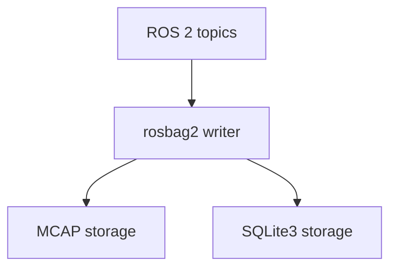
```mermaid
flowchart TD
    TOP["ROS 2 topics"] --> WR["rosbag2 writer"]
    WR --> MCAP["MCAP storage"]
    WR --> SQL["SQLite3 storage"]
```

### MCAP

**MCAP** — формат контейнера для timestamped-сообщений и связанных с ними схем, каналов, метаданных и индексов. В актуальном `rosbag2` доступны плагины `mcap` и `sqlite3`, а MCAP используется как формат хранения по умолчанию [2, 3].

Почему MCAP удобен для анализа больших робототехнических данных:

- один контейнер может хранить сообщения разных типов;
- есть индексы для более удобного поиска;
- поддерживаются чанки и компрессия;
- формат удобно переносить между инструментами;
- запись можно анализировать вне полноценного ROS-окружения.

Логические сущности:

```text
Schema
Channel
Message
Metadata
Indexes
Chunks
```

Расшифровка:

- **Schema (схема)** — описание структуры данных: какие поля и каких типов содержит сообщение.
- **Channel (канал)** — логическое описание потока, связанное с topic и схемой.
- **Message (сообщение)** — конкретная запись с payload и временем.
- **Metadata (метаданные)** — данные о данных: параметры записи, контекст, служебная информация.
- **Index (индекс)** — структура для ускорения поиска нужного места в файле.
- **Chunk (чанк, блок)** — группа записей, которая может храниться и сжиматься совместно.

Пример:

```text
Schema:
  sensor_msgs/Imu

Channel:
  /imu/data
  message_encoding = cdr

Message:
  log_time
  publish_time
  raw CDR payload
```

---

## 6. CDR-сериализация: как объект сообщения превращается в байты

ROS 2 обычно использует **CDR (Common Data Representation — общее представление данных)** в DDS-стеке.

**Сериализация (serialization)** — преобразование объекта программы в последовательность байтов, которую можно передать по сети или сохранить в файл. **Десериализация** — обратное преобразование байтов в объект с полями.

**DDS (Data Distribution Service)** — стандарт middleware для распределённого обмена данными.  
**IDL (Interface Definition Language — язык описания интерфейсов)** — способ формально описать структуру сообщения независимо от конкретного языка программирования.

Простая аналогия: схема сообщения — это «форма анкеты», объект — заполненная анкета, а CDR-последовательность — упакованный бинарный конверт для передачи.

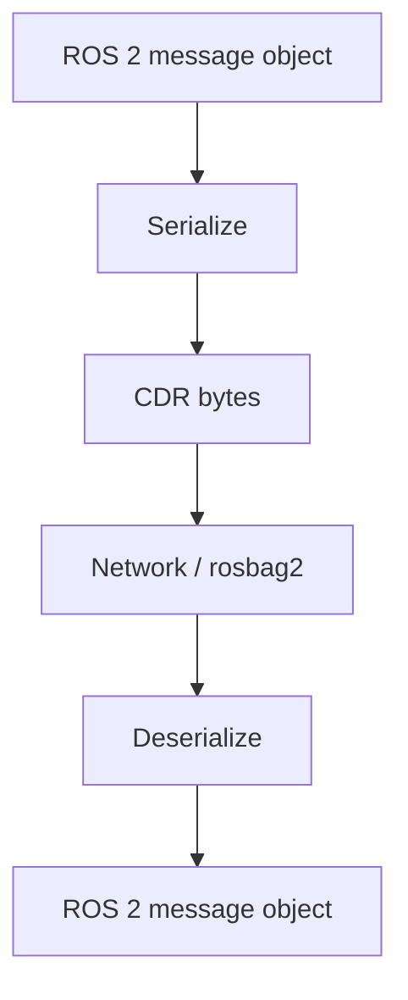
```mermaid
flowchart TD
    OBJ1["ROS 2 message object"] --> SER["Serialize"]
    SER --> CDR["CDR bytes"]
    CDR --> IO["Network / rosbag2"]
    IO --> DES["Deserialize"]
    DES --> OBJ2["ROS 2 message object"]
```

Нужно различать:

- схему;
- сериализованный payload;
- timestamp;
- topic/channel metadata.

Это критично при анализе bag вне **ROS environment (окружения ROS)**: файл содержит байты, но для их корректного понимания программе нужно знать схему сообщения и способ сериализации.

> **Частая ошибка:** считать, что MCAP «сам знает смысл каждого байта». Контейнер хранит данные и метаданные, но корректная интерпретация зависит от схемы/типа сообщения.

---

## 7. Чтение rosbag без ROS

`rosbags` — библиотека на **pure Python (чистом Python, без обязательной установки полного ROS software stack)** для чтения rosbag1/rosbag2 [4].

**Software stack (программный стек)** — совокупность взаимосвязанных программных компонентов и зависимостей. В данном случае идея важна педагогически: для анализа файла в Google Colab студенту необязательно разворачивать весь ROS 2.

```python
!pip -q install rosbags pandas pyarrow
```

### `AnyReader`

`AnyReader` — высокоуровневый «универсальный читатель»: он открывает bag, даёт список доступных соединений/топиков, читает сырые сообщения и помогает десериализовать их в Python-объекты.

```python
from pathlib import Path

from rosbags.highlevel import AnyReader
import pandas as pd

bag_path = Path("/content/my_rosbag")

rows = []

with AnyReader([bag_path]) as reader:
    connections = [
        c for c in reader.connections
        if c.topic == "/imu/data"
    ]

    for connection, timestamp, rawdata in reader.messages(
        connections=connections
    ):
        msg = reader.deserialize(
            rawdata,
            connection.msgtype
        )

        rows.append({
            "timestamp_ns": timestamp,
            "ax": msg.linear_acceleration.x,
            "ay": msg.linear_acceleration.y,
            "az": msg.linear_acceleration.z,
            "wx": msg.angular_velocity.x,
            "wy": msg.angular_velocity.y,
            "wz": msg.angular_velocity.z,
        })

imu = pd.DataFrame(rows)

imu["accel_norm"] = (
    imu["ax"] ** 2 +
    imu["ay"] ** 2 +
    imu["az"] ** 2
) ** 0.5

imu.head()
```

Для **custom message type (пользовательского типа сообщения)** требуется зарегистрировать соответствующее `.msg`/IDL-определение в **typestore** — хранилище описаний типов. Иначе библиотека видит байты, но не знает, как разложить их по полям.

---

## 8. MCAP Python tooling без ROS

```python
!pip -q install mcap mcap-ros2-support
```

Python-инструменты MCAP поддерживают работу со схемами/кодировками ROS 2 вне полноценного ROS 2 environment [5]. **Tooling** здесь означает набор библиотек и утилит для чтения, записи и преобразования данных.

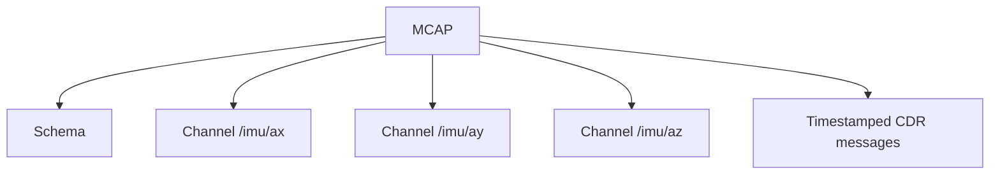
```mermaid
flowchart TD
    M["MCAP"] --> S["Schema"]
    M --> AX["Channel /imu/ax"]
    M --> AY["Channel /imu/ay"]
    M --> AZ["Channel /imu/az"]
    M --> MSG["Timestamped CDR messages"]
```

Для Google Colab это важный архитектурный приём: bag становится обычным входным **data artifact (артефактом данных, то есть файлом — результатом работы системы)**, а не причиной разворачивать полноценную middleware-инфраструктуру.

---

## 9. Синхронизация сенсоров

**Синхронизация** нужна потому, что разные датчики измеряют мир с разной частотой и их сообщения приходят не одновременно. Например, IMU может работать на 200 Hz, а LiDAR — на 10 Hz.

Пусть IMU измеряется в моменты:

$$t_i^{\mathrm{IMU}}.$$

а LiDAR:

$$t_j^{\mathrm{LiDAR}}.$$

Простейшее **nearest-neighbor (сопоставление ближайшего соседа по времени)**: для каждого измерения одного датчика ищется измерение другого датчика с наиболее близкой временной отметкой.

$$j^*=\arg\min_j\left|t_i^{\mathrm{IMU}}-t_j^{\mathrm{LiDAR}}\right|.$$

Допустимая ошибка синхронизации:

$$\left|t_i^{\mathrm{IMU}}-t_{j^*}^{\mathrm{LiDAR}}\right|\le\varepsilon.$$

Здесь $\varepsilon$ — максимально допустимое рассогласование времени. Если $\varepsilon$ слишком велико, объединённый **sample (совместный пример данных)** может описывать физически разные состояния робота.

Например, при быстром повороте кадр камеры «сейчас» и IMU «100 мс назад» могут уже относиться к заметно разным ориентациям. Поэтому timestamp — не служебная мелочь, а часть физического смысла данных.

---

## 10. Edge Computing — обработка данных рядом с роботом

**Edge Computing (периферийные вычисления)** — обработка части данных непосредственно на роботе или на близком вычислительном узле, до отправки в центральное хранилище/облако.

Передавать все **raw sensor data (сырые сенсорные данные)** в центральную систему не всегда возможно: ограничены пропускная способность сети, накопитель, вычислительные ресурсы и допустимая задержка.

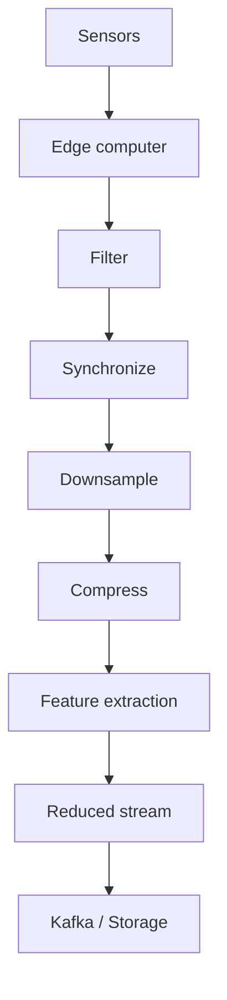
```mermaid
flowchart TD
    S["Sensors"] --> E["Edge computer"]
    E --> F["Filter"]
    F --> SY["Synchronize"]
    SY --> DS["Downsample"]
    DS --> C["Compress"]
    C --> FE["Feature extraction"]
    FE --> OUT["Reduced stream"]
    OUT --> KS["Kafka / Storage"]
```

Что делают этапы:

- **Filter (фильтрация)** — уменьшает шум или удаляет явно ненужные значения.
- **Synchronize (синхронизация)** — сопоставляет данные разных датчиков по времени.
- **Downsample (понижение частоты)** — оставляет меньше отсчётов.
- **Compress (сжатие)** — уменьшает размер представления данных.
- **Feature extraction (извлечение признаков)** — вместо всего сигнала вычисляет компактные характеристики, например RMS, максимум, среднее.
- **Reduced stream (уменьшенный поток)** — поток, в котором сохранена нужная информация, но меньше объём.
- **Kafka** — распределённая платформа событийных потоков; в архитектурной схеме она играет роль «транспортной магистрали» между источниками и системами обработки/хранения.

### 10.1. Снижение трафика

$$K_{\mathrm{edge}}=\frac{R_{\mathrm{raw}}}{R_{\mathrm{out}}}.$$

Если исходный поток 80 MB/s, а после edge preprocessing — 2 MB/s:

$$K_{\mathrm{edge}}=40.$$

### 10.2. Downsampling — уменьшение частоты данных

Для коэффициента $M$:

$$f_{\mathrm{out}}=\frac{f_{\mathrm{in}}}{M}.$$

**Decimation (децимация)** — уменьшение частоты дискретных отсчётов, например сохранение каждого десятого значения. Но перед этим обычно требуется **low-pass filtering (фильтрация нижних частот)**.

Без фильтрации может возникнуть **aliasing (алиасинг, наложение спектров)**: быстрые изменения сигнала после уменьшения частоты начинают выглядеть как более медленные, которых в физическом процессе не было.

Критерий Найквиста:

$$f_s>2f_{\mathrm{max}}.$$

Для курса важен инженерный вывод: уменьшение частоты нельзя выполнять только ради экономии места, не исследовав содержимое сигнала.

### 10.3. Потоковая или пакетная обработка?

**Streaming (потоковая обработка)** анализирует данные по мере поступления.  
**Batch (пакетная обработка)** сначала накапливает набор данных, а затем обрабатывает его целиком или крупными порциями.

| Критерий | Streaming | Batch |
|---|---|---|
| Когда нужен результат | сейчас или через секунды | после накопления данных |
| Типичная задача | аварийная тревога, онлайн-мониторинг | отчёт за смену, обучение модели |
| Главная ценность | малая задержка | эффективная обработка большой истории |
| Сложность | выше: состояние, время событий, запоздавшие данные | обычно проще |
| Для робота | реакция во время работы | анализ после миссии |

**Что лучше?** Не существует универсального победителя. В реальной робототехнике они дополняют друг друга:

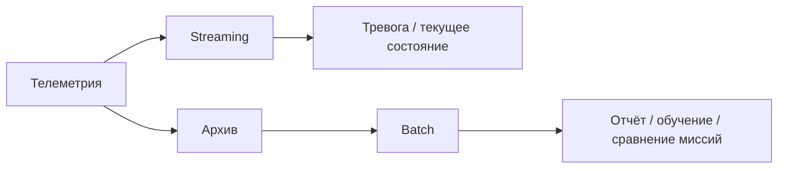
```mermaid
flowchart LR
    S["Телеметрия"] --> ST["Streaming"]
    ST --> A["Тревога / текущее состояние"]
    S --> B["Архив"]
    B --> BA["Batch"]
    BA --> R["Отчёт / обучение / сравнение миссий"]
```

Потоковая обработка преобладает там, где ценность результата быстро падает со временем: перегрев двигателя полезно заметить **сейчас**, а не в отчёте вечером. Пакетная обработка выгоднее, когда важен полный исторический набор и немедленная реакция не требуется.

---

## 11. База данных временных рядов (Time-Series Database, TSDB)

**Time-Series Database (TSDB — база данных временных рядов)** оптимизирована для данных, в которых почти каждая запись привязана ко времени.

В отличие от обычной учебной таблицы «объект — свойства», телеметрия чаще выглядит как длинная последовательность: `когда → какой робот → какой параметр → какое значение`.

Типичная схема:

```text
timestamp
robot_id
sensor
value
quality
```

Типичная **time-series workload (нагрузка временных рядов)** характеризуется:

- **append-heavy ingestion** — в систему постоянно дописываются новые измерения;
- **range queries** — запросами по диапазону времени, например «последние 30 минут»;
- агрегатами по **time buckets (временным корзинам)**, например среднее за каждую минуту;
- **retention** — политикой срока хранения детальных данных;
- **downsampling** — хранением более грубых агрегатов для старой истории.

### TimescaleDB

```sql
CREATE TABLE telemetry (
    ts          TIMESTAMPTZ NOT NULL,
    robot_id    TEXT        NOT NULL,
    motor_temp  DOUBLE PRECISION,
    vibration   DOUBLE PRECISION
);
```

Агрегирование:

```sql
SELECT
    time_bucket('1 minute', ts) AS bucket,
    robot_id,
    AVG(motor_temp) AS avg_temp,
    MAX(motor_temp) AS max_temp
FROM telemetry
GROUP BY bucket, robot_id
ORDER BY bucket, robot_id;
```

**Continuous aggregate (непрерывный агрегат)** хранит заранее вычисляемые и постепенно обновляемые временные агрегаты. Это экономит повторные вычисления: системе не нужно каждый раз пересчитывать среднее за час из миллионов исходных строк [11].

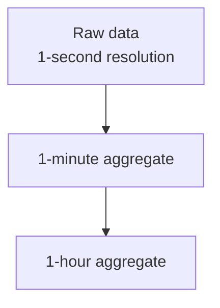
```mermaid
flowchart TD
    RAW["Raw data<br/>1-second resolution"] --> M1["1-minute aggregate"]
    M1 --> H1["1-hour aggregate"]
```

---

## 12. RMS — среднеквадратичное значение

Для вибрации:

$$\mathrm{RMS}=\sqrt{\frac{1}{N}\sum_{i=1}^{N}x_i^2}.$$

**RMS (Root Mean Square — среднеквадратичное значение)** измеряет типичный энергетический уровень колеблющегося сигнала и не компенсирует положительные и отрицательные значения друг другом.

Для педагога удобная интуиция: обычное среднее вибрации `+1, -1, +1, -1` близко к нулю, хотя колебание сильное. RMS останется ненулевым и поэтому лучше отражает уровень вибрации.

```python
import numpy as np

window = np.array([0.10, 0.12, 0.11, 0.75, 0.70])

rms = np.sqrt(np.mean(window ** 2))
print(rms)
```

---

## 13. Z-score

**Z-score (стандартизованное отклонение)** показывает, на сколько стандартных отклонений значение удалено от среднего:

$$z_i=\frac{x_i-\mu}{\sigma}.$$

где $\mu$ — среднее, а $\sigma$ — стандартное отклонение.

Учебное правило:

$$\lvert z_i\rvert\ge3\Rightarrow\mathrm{candidate\ anomaly}.$$

Ограничения:

- **drift (дрейф)** — постепенное изменение нормального уровня;
- **нестационарность** — статистические свойства сигнала меняются со временем;
- **multimodal distribution (мультимодальное распределение)** — у нормального процесса несколько различных режимов, например «движение» и «стоянка»;
- выбросы сами искажают $\mu$ и $\sigma$.

Z-score не является «детектором неисправности» сам по себе; он выделяет статистически необычные точки относительно выбранного **baseline (базового нормального режима)**. Инженер ещё должен объяснить, почему необычное значение связано или не связано с реальной неисправностью.

---

## 14. Энтропия сенсорного окна

**Энтропия** здесь используется как числовая характеристика разнообразия/непредсказуемости состояний внутри окна. Она не измеряет «полезность» данных и сама по себе не диагностирует неисправность.

Для дискретизированных состояний:

$$H(X)=-\sum_i p_i\log_2p_i.$$

**Feature vector (вектор признаков)** — компактный набор чисел, которыми мы описываем целое окно исходного сигнала:

$$\mathbf{z}=[\mu,\sigma,\mathrm{RMS},\min,\max,H]^T.$$

Вместо передачи тысячи отсчётов можно передать несколько осмысленных признаков — если это не уничтожает информацию, нужную для задачи.

Энтропия может изменяться при смене динамического режима, но должна интерпретироваться вместе с физическими признаками.

---

## 15. Скользящая статистика

**Скользящее окно (rolling window)** — небольшая «рамка» последних $N$ измерений, которая движется вместе с потоком. При приходе нового значения старое постепенно выходит из окна.

Среднее на последних $N$ измерениях:

$$\bar{x}_t=\frac{1}{N}\sum_{i=t-N+1}^{t}x_i.$$

RMS:

$$\mathrm{RMS}_t=\sqrt{\frac{1}{N}\sum_{i=t-N+1}^{t}x_i^2}.$$

Rolling Z-score:

$$z_t=\frac{x_t-\mu_t}{\sigma_t}.$$

---

## 16. PySpark-анализ временного ряда: массовая обработка данных

**Apache Spark** — система распределённой обработки больших наборов данных. **PySpark** — Python API для Spark. В учебном Colab мы можем запускать Spark локально, но программная модель остаётся близкой к той, что используется на кластере.

`DataFrame` в Spark — распределённая табличная структура. `Window` в данном фрагменте — аналитическое окно по строкам конкретного робота, а не оконный элемент графического интерфейса.

В 2026 году Spark 4.2.0 является выпущенной стабильной версией; релиз опубликован 14 июля 2026 года [6].

```python
!pip -q install "pyspark==4.2.0"

from pyspark.sql import SparkSession, functions as F, Window

spark = (
    SparkSession.builder
    .master("local[*]")  # local[*] = использовать локальные ядра процессора
    .appName("Lecture03")
    .getOrCreate()
)

data = [
    ("robot-01", 1, 45.0, 0.20),
    ("robot-01", 2, 45.2, 0.21),
    ("robot-01", 3, 45.1, 0.19),
    ("robot-01", 4, 58.0, 0.80),
    ("robot-01", 5, 59.5, 0.84),
]

df = spark.createDataFrame(
    data,
    ["robot_id", "t", "temperature", "vibration"]
)

w = (
    Window
    .partitionBy("robot_id")
    .orderBy("t")
    .rowsBetween(-2, 0)
)

result = (
    df
    .withColumn(
        "vibration_rms",
        F.sqrt(
            F.avg(F.pow("vibration", 2)).over(w)
        )
    )
    .withColumn(
        "temp_mean_3",
        F.avg("temperature").over(w)
    )
)

result.show()
```

---

## 17. Архитектура мониторинга

Теперь объединим термины в одну архитектуру. Важно понимать, что разные хранилища решают **разные задачи**, а не конкурируют за роль «единственной базы».

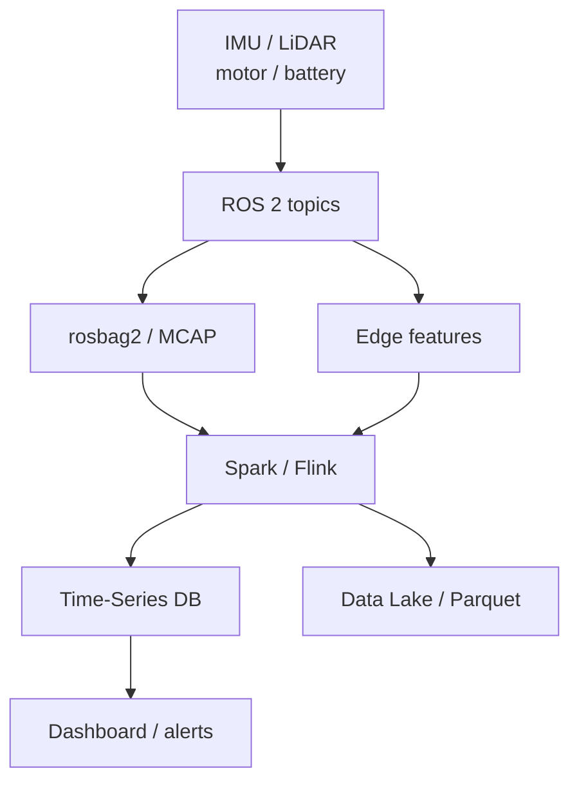
```mermaid
flowchart TD
    S["IMU / LiDAR<br/>motor / battery"] --> ROS["ROS 2 topics"]
    ROS --> BAG["rosbag2 / MCAP"]
    ROS --> EDGE["Edge features"]
    BAG --> PROC["Spark / Flink"]
    EDGE --> PROC
    PROC --> TSDB["Time-Series DB"]
    PROC --> LAKE["Data Lake / Parquet"]
    TSDB --> DASH["Dashboard / alerts"]
```

Расшифровка новых терминов:

- **Data Lake (озеро данных)** — хранилище больших объёмов файлов и наборов в исходном или близком к исходному виде.
- **Parquet** — колоночный файловый формат, удобный для аналитических таблиц.
- **Dashboard (информационная панель)** — визуальный экран состояния системы.
- **Alert (оповещение)** — автоматически сформированное сообщение о выполнении условия, например о перегреве.
- **Spark** удобен для массового анализа истории.
- **Flink** и аналогичные streaming-системы ориентированы на непрерывные потоки и оконные вычисления; современная документация Flink отдельно рассматривает event time, окна и запаздывающие данные [7].

### Горячие и холодные данные

Полезно различать уровни хранения:

| Уровень | Что хранится | Зачем |
|---|---|---|
| **Hot data — горячие данные** | последние минуты/часы телеметрии | быстрый мониторинг |
| **Warm data — тёплые данные** | агрегаты за дни/недели | отчёты и сравнение |
| **Cold data — холодные данные** | тяжёлые архивы MCAP, изображения, Parquet | расследования, обучение, воспроизводимость |

Это объясняет, почему нельзя всё хранить только в одной TSDB или только в MCAP. **MCAP хорошо сохраняет эксперимент**, а TSDB хорошо отвечает на временные запросы, Data Lake — хранит долгую историю, Spark/Flink — обрабатывают её в разных режимах.

### Современная архитектура парка роботов

Когда роботов становится много, к сенсорным данным добавляются данные верхнего уровня:

- состояние задания;
- заряд батареи;
- местоположение;
- доступность зон и лифтов;
- время выполнения миссии;
- конфликт маршрутов;
- события обслуживания.

Open-RMF (Robotics Middleware Framework) — пример современной открытой платформы для multi-fleet management, то есть координации нескольких парков роботов и общих ресурсов [8].

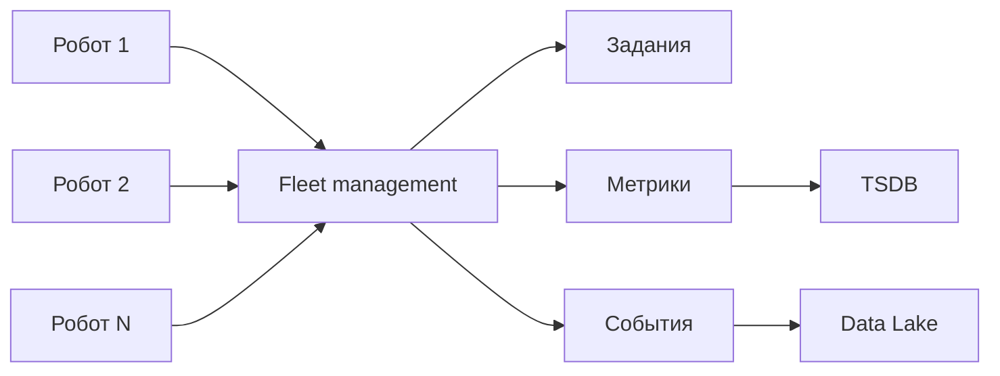
```mermaid
flowchart LR
    R1["Робот 1"] --> F["Fleet management"]
    R2["Робот 2"] --> F
    R3["Робот N"] --> F
    F --> T["Задания"]
    F --> M["Метрики"]
    F --> E["События"]
    M --> TS["TSDB"]
    E --> DL["Data Lake"]
```

Здесь Big Data появляется уже не только из-за тяжёлой камеры или LiDAR, но и из-за **масштаба эксплуатации**: много роботов, много миссий, длинная история и необходимость сравнивать поведение системы.

### Данные для обучения, симуляции и цифрового двойника

Современная робототехника всё чаще использует цикл:

`реальный робот -> запись данных -> анализ -> обучение/проверка -> симуляция -> новая версия алгоритма -> робот`.

**Digital twin (цифровой двойник)** — цифровая модель физической системы и её среды, используемая для анализа или проверки сценариев.  
**Synthetic data (синтетические данные)** — данные, полученные не непосредственным измерением реального мира, а программной генерацией/симуляцией.

NVIDIA Isaac Sim, например, поддерживает ROS 2, физическую симуляцию, моделирование сенсоров и генерацию синтетических данных для робототехнических задач [9, 10]. Педагогически это важно: большие данные робота сегодня — это не только данные **с реального робота**, но и управляемые наборы данных **из симуляции**.

---

## 18. Teach: педагогический мост

### Как объяснять сенсорные данные (sensor data)

Использовать смартфон как знакомый объект:

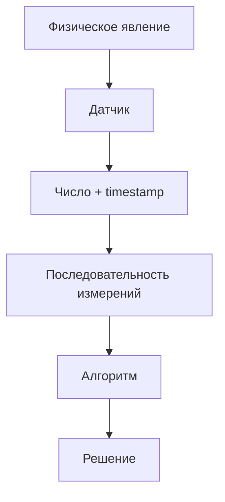
```mermaid
flowchart TD
    P["Физическое явление"] --> S["Датчик"]
    S --> V["Число + timestamp"]
    V --> Q["Последовательность измерений"]
    Q --> A["Алгоритм"]
    A --> D["Решение"]
```

### Как «разжевать» архитектуру студенту

Предлагайте студенту на каждом этапе отвечать на четыре вопроса:

1. **Что физически произошло?** Например, двигатель нагрелся.
2. **Как это стало числом?** Датчик выдал `temperature = 78.3`.
3. **Куда число пошло?** Topic → edge-обработка → хранилище.
4. **Какое решение принимаем?** Показать предупреждение, остановить миссию или сохранить эпизод для анализа.

Если студент может проследить эти четыре шага, он понимает смысл технологии, а не только названия инструментов.

### Типичные ошибки

1. «Чем выше частота, тем всегда лучше».
2. «Timestamp разных сенсоров одинаково точен».
3. «Любой выброс означает неисправность».
4. «RMS — обычное среднее».
5. «Edge заменяет cloud». На практике Edge и центральная инфраструктура обычно дополняют друг друга.
6. «Если данные записаны в MCAP, значит они уже проанализированы». MCAP — прежде всего контейнер хранения.
7. «Streaming всегда лучше Batch». Streaming нужен для своевременной реакции; Batch удобен для полной исторической обработки.
8. «Аномалия = неисправность». Статистическая необычность ещё требует физической интерпретации.
9. «Timestamp — просто номер времени». Ошибка времени может сделать неправильным объединение сенсоров.
10. «Большие данные начинаются только с терабайтов». Для робототехники критичны также скорость, разнообразие и необходимость своевременной реакции.

### Школьный микрокейс

**Проект:** «Определение удара мобильного робота по акселерометру».

Дано:

```text
timestamp, ax, ay, az
```

Рассчитать:

$$a=\sqrt{a_x^2+a_y^2+a_z^2}.$$

затем rolling RMS и threshold.

Необходимо:

1. выделить интервалы удара;
2. построить график;
3. объяснить false positive;
4. предложить дополнительный sensor feature.

**НТО-усложнение:** объединить IMU и ток двигателя; тревогу считать достоверной только при согласованном изменении нескольких признаков.

---

## 19. Контрольные вопросы

1. Почему частота датчика одновременно влияет на требования к хранилищу, сети и вычислениям?
2. Расшифруйте IMU, LiDAR, ROS, DDS, CDR, RMS и TSDB и объясните роль каждого понятия одной фразой.
3. Чем ROS message object отличается от CDR payload, topic и storage format?
4. Зачем `rosbag2` нужен инженеру, если данные уже проходили через ROS 2?
5. Чем MCAP отличается от topic и от Time-Series DB?
6. Какие преимущества и ограничения даёт анализ rosbag без установленного ROS?
7. Почему downsampling без фильтрации может изменить физический смысл сигнала?
8. Чем RMS, Z-score и энтропия описывают разные свойства временного ряда?
9. Почему аномальное значение ещё нельзя автоматически называть неисправностью?
10. Чем streaming отличается от batch и какой режим нужен для предупреждения о перегреве?
11. Зачем Edge Computing используется до отправки данных в центральную систему?
12. Почему один и тот же проект может одновременно использовать MCAP, TSDB и Data Lake?
13. Что такое event time и почему время получения сообщения компьютером не всегда равно времени физического события?
14. Какие новые Big Data-задачи возникают при переходе от одного робота к парку из десятков роботов?
15. Зачем в современной робототехнике соединяют реальные и синтетические данные?

---

## 20. Словарь сокращений и технических терминов

| Термин / сокращение | Расшифровка | Понятное объяснение |
|---|---|---|
| **AI** | Artificial Intelligence | искусственный интеллект |
| **API** | Application Programming Interface | программный интерфейс для взаимодействия компонентов |
| **Batch** | пакетная обработка | анализ накопленного набора данных |
| **CDR** | Common Data Representation | бинарное представление данных для передачи/хранения |
| **DDS** | Data Distribution Service | middleware-стандарт распределённого обмена данными |
| **Edge Computing** | периферийные вычисления | обработка рядом с источником данных, например прямо на роботе |
| **Feature** | признак | числовая характеристика сигнала, например среднее или RMS |
| **Hz** | hertz, герц | количество событий/измерений в секунду |
| **IDL** | Interface Definition Language | формальное описание структуры сообщений |
| **IMU** | Inertial Measurement Unit | инерциальный модуль: ускорения и угловые скорости |
| **IoT** | Internet of Things | Интернет вещей: сеть физических устройств с датчиками и связью |
| **IT** | Information Technology | информационные технологии: вычисления, ПО, БД, сети и аналитика |
| **OT** | Operational Technology | технологии управления физическим оборудованием и производственными процессами |
| **RTPS** | Real-Time Publish-Subscribe | сетевой протокол семейства DDS для обмена данными |
| **RMF / Open-RMF** | Robotics Middleware Framework | платформа координации роботов и робототехнических флотов |
| **KB / MB / GB** | kilobyte / megabyte / gigabyte | единицы объёма данных |
| **LiDAR** | Light Detection and Ranging | лазерное измерение расстояний и построение облака точек |
| **MCAP** | название формата контейнера | файл для timestamped-сообщений, схем, каналов и индексов |
| **ML** | Machine Learning | машинное обучение |
| **QoS** | Quality of Service | политики качества доставки сообщений |
| **RMS** | Root Mean Square | среднеквадратичное значение сигнала |
| **RMW** | ROS Middleware | слой ROS 2, связывающий ROS API с конкретным middleware |
| **ROS 2** | Robot Operating System 2 | набор библиотек и инструментов для робототехнических приложений |
| **SDG** | Synthetic Data Generation | генерация синтетических данных |
| **SQL** | Structured Query Language | язык запросов к табличным БД |
| **TSDB** | Time-Series Database | база данных временных рядов |
| **DataFrame** | табличная абстракция анализа | набор строк и столбцов для обработки данных |
| **Data Lake** | озеро данных | масштабное файловое хранилище исходных и подготовленных наборов |
| **Digital Twin** | цифровой двойник | цифровая модель физической системы/процесса |
| **Downsampling** | понижение частоты | уменьшение числа отсчётов |
| **Event time** | время события | когда измерение физически произошло |
| **Ingestion** | приём/загрузка данных | поступление данных в систему хранения/обработки |
| **Metadata** | метаданные | описание данных: тип, источник, параметры записи и т. п. |
| **Middleware** | промежуточное ПО | слой связи между прикладными компонентами |
| **Payload** | полезная нагрузка | собственно значения сообщения без части служебных данных |
| **Point cloud** | облако точек | набор 3D-точек, описывающих окружающее пространство |
| **Serialization** | сериализация | преобразование структуры данных в байты |
| **Streaming** | потоковая обработка | обработка данных по мере их появления |
| **Apache Spark** | система распределённой аналитики | массовая обработка таблиц и больших наборов данных |
| **PySpark** | Python API Apache Spark | использование Spark из Python |
| **Apache Flink** | stream-processing framework | обработка непрерывных потоков и событийных окон |
| **Apache Kafka** | event streaming platform | транспорт и хранение потоков событий между компонентами |
| **SQLite / SQLite3** | встраиваемая реляционная БД | файловая SQL-БД без отдельного серверного процесса |
| **Parquet** | колоночный файловый формат | компактное хранение аналитических таблиц |
| **rosbag2** | подсистема ROS 2 | запись и воспроизведение потоков сообщений |
| **Google Colab** | облачная notebook-среда | запуск Python-кода в браузере без локальной настройки окружения |
| **Timestamp** | временная отметка | время, связанное с измерением/сообщением |
| **Topic** | топик | именованный канал сообщений в ROS 2 |
| **Watermark** | водяной знак потока | оценка прогресса event time при запаздывающих событиях |
| **Z-score** | стандартизованное отклонение | расстояние значения от среднего в единицах стандартного отклонения |
| **Aliasing** | наложение спектров | искажение сигнала при недостаточной частоте дискретизации |
| **Baseline** | базовый режим | данные/характеристики, считающиеся нормой |
| **Drift** | дрейф | постепенное изменение сигнала или его статистики |
| **False positive** | ложное срабатывание | система сообщила об аномалии, хотя реальной проблемы нет |

## 21. Основные источники

Актуальность ссылок проверена: **07.10.2026**.

1. ROS 2 Documentation. **Different ROS 2 middleware vendors**: DDS, RTPS, QoS and middleware concepts.  
   https://docs.ros.org/en/ros2_documentation/kilted/Concepts/Intermediate/About-Different-Middleware-Vendors.html
2. Open Robotics. **rosbag2**: repository and current storage architecture.  
   https://github.com/ros2/rosbag2
3. Open Robotics. **rosbag2_storage_mcap**: MCAP storage plugin.  
   https://github.com/ros2/rosbag2/tree/rolling/rosbag2_storage_mcap
4. Ternaris. **Rosbags documentation**.  
   https://ternaris.gitlab.io/rosbags/
5. Foxglove. **MCAP**.  
   https://github.com/foxglove/mcap
6. Apache Software Foundation. **Apache Spark 4.2.0 Release**, 14.07.2026.  
   https://spark.apache.org/releases/spark-release-4-2-0.html
7. Apache Software Foundation. **Apache Flink — Streaming Analytics**.  
   https://nightlies.apache.org/flink/flink-docs-stable/docs/learn-flink/streaming_analytics/
8. Open-RMF. **Robotics Middleware Framework — multi-fleet robot management**.  
   https://github.com/open-rmf/rmf
9. NVIDIA. **Isaac Sim — robotics simulation and synthetic data generation**.  
   https://docs.isaacsim.omniverse.nvidia.com/
10. NVIDIA. **Isaac Sim — Synthetic Data Generation**.  
    https://docs.isaacsim.omniverse.nvidia.com/latest/synthetic_data_generation/index.html
11. Timescale. **Continuous aggregates**.  
    https://docs.timescale.com/use-timescale/latest/continuous-aggregates/about-continuous-aggregates/
12. ROS 2 Documentation. **Topic Statistics**.  
    https://docs.ros.org/en/ros2_documentation/kilted/Tutorials/Advanced/Topic-Statistics-Tutorial/Topic-Statistics-Tutorial.html

13. International Federation of Robotics. **Top 5 Global Robotics Trends 2026**, 08.01.2026.  
    https://ifr.org/ifr-press-releases/news/top-5-global-robotics-trends-2026
14. International Federation of Robotics. **Five Million Robots now Operate in Factories Globally — World Robotics 2026**, 24.09.2026.  
    https://ifr.org/ifr-press-releases/news/five-million-robots-now-operate-in-factories-globally
15. International Federation of Robotics. **Global Sales of Professional Service Robots Surge 24%**, 30.09.2026.  
    https://ifr.org/ifr-press-releases/P26
