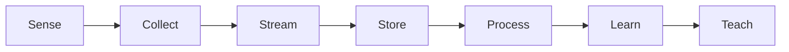
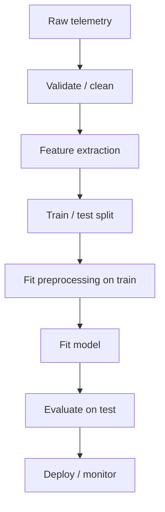
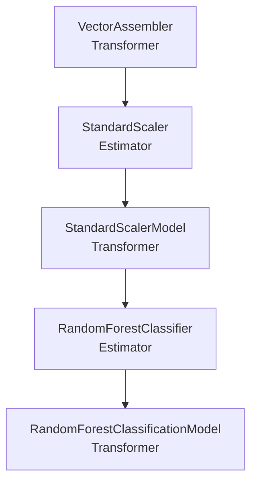
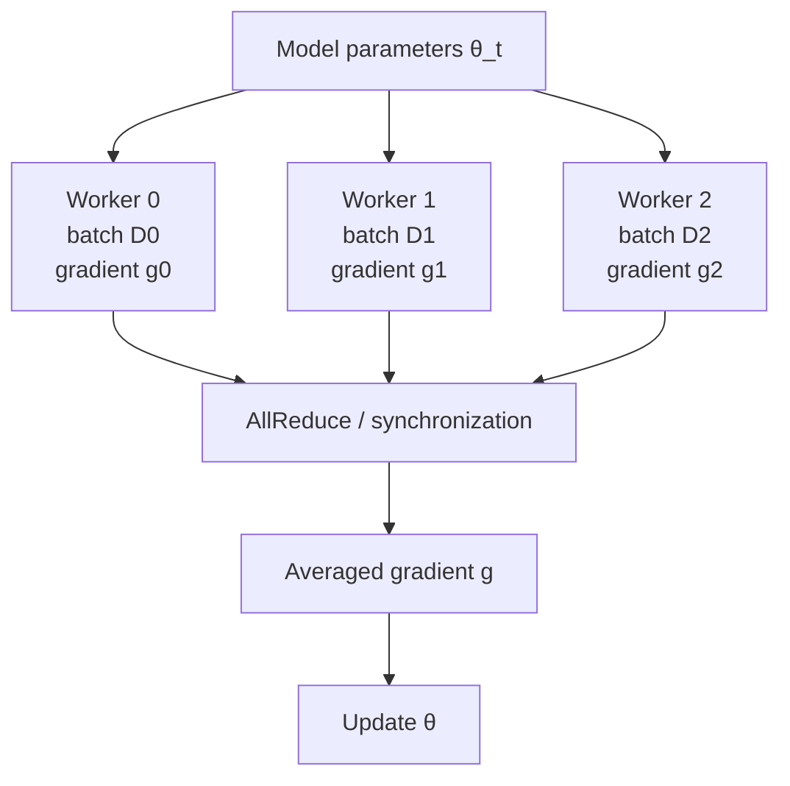
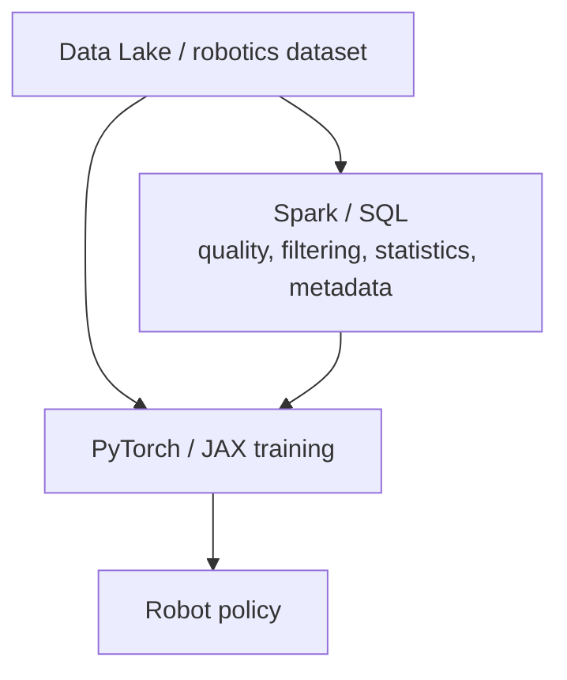
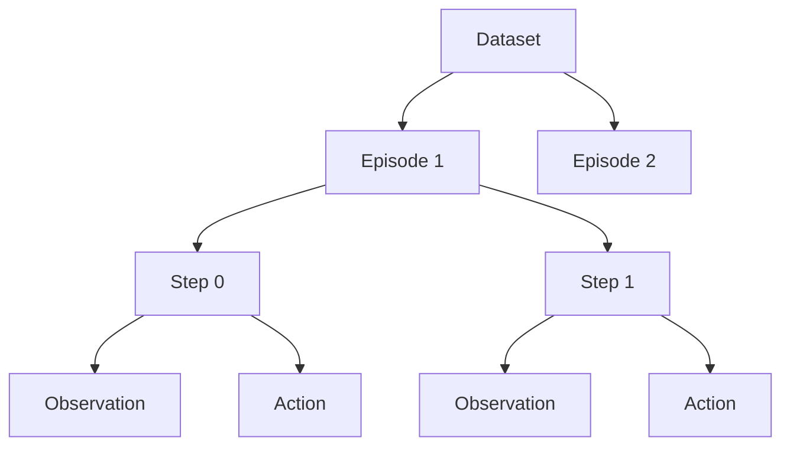
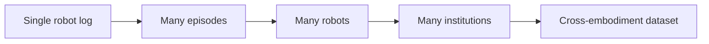
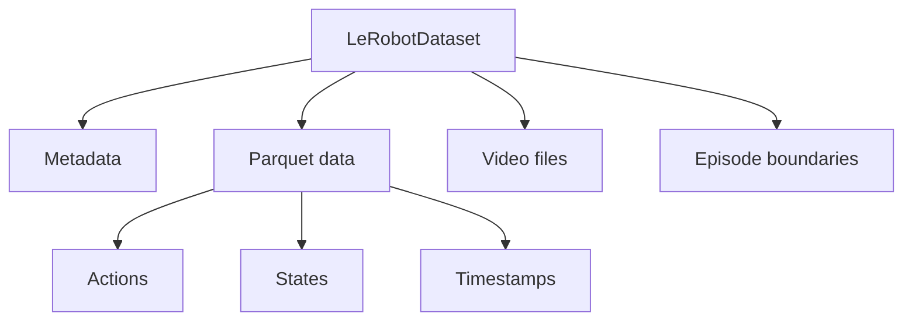
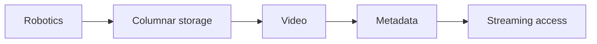
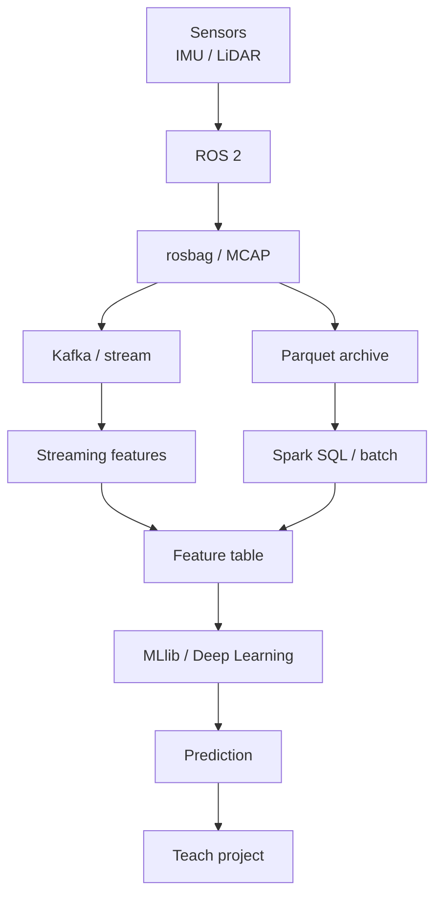

# Лекция 4. Масштабируемая аналитика, машинное обучение и образовательные проекты

**Дисциплина:** «Методы обработки больших данных»  
**Направление:** 44.03.05 Педагогическое образование  
**Профиль:** «Информатика и дополнительное образование (робототехника)»  
**Этапы пайплайна:** `Learn -> Teach`



## 1. Тема и план лекции

1. Spark MLlib Pipeline API: Transformers, Estimators, features, train/test split и data leakage.
2. Метрики классификации/регрессии и функции потерь.
3. Data-parallel distributed training и стоимость синхронизации.
4. Большие робототехнические datasets: Open X-Embodiment и Hugging Face LeRobot.
5. Streaming datasets и проектирование школьных/олимпиадных data-проектов.

После лекции студент должен уметь построить воспроизводимый ML pipeline над телеметрией, выбрать адекватные метрики, объяснить synchronous data parallelism и спроектировать педагогическую адаптацию сложного robotics data pipeline.

---

## 2. ML pipeline

Корректная последовательность:



Главное ограничение: операции, использующие статистики данных, не должны видеть test set при обучении.

### Data leakage

Если mean/std для нормализации рассчитаны на полном dataset:

$$\mu=\frac{1}{N_{\mathrm{train}}+N_{\mathrm{test}}}\sum_{i=1}^{N}x_i.$$

то информация test set участвует в preprocessing. Оценка становится оптимистичной.

Правильно:

$$\mu_{\mathrm{train}}=\frac{1}{N_{\mathrm{train}}}\sum_{i\in\mathrm{train}}x_i.$$

---

## 3. Transformer и Estimator в Spark MLlib

**Transformer**

$$T:D\rightarrow D'.$$

Имеет:

```text
transform(dataset)
```

Примеры:

- `VectorAssembler`;
- fitted `StandardScalerModel`;
- fitted classification/regression model.

**Estimator**

$$E:D\rightarrow T.$$

Имеет:

```text
fit(dataset)
```

Примеры:

- `StandardScaler`;
- `LogisticRegression`;
- `RandomForestClassifier`.



Pipeline сам является Estimator: `fit()` последовательно обучает стадии и формирует `PipelineModel`.

---

## 4. Feature engineering телеметрии

Окно сырого сигнала:

$$x_1,\dots,x_N$$

преобразуется в признаки:

$$\mathbf{z}=[\mu,\sigma,\mathrm{RMS},\min,\max,\mathrm{slope},H]^T.$$

Для робота:

```text
temperature_mean
temperature_max
vibration_rms
battery_drop_rate
current_peak
accel_rms
```

Модель должна получать признаки, имеющие физическую и статистическую интерпретацию.

---

## 5. Метрики классификации

| Фактический класс | Предсказано 0 | Предсказано 1 |
|---|---:|---:|
| **0** | TN | FP |
| **1** | FN | TP |

Precision:

$$\mathrm{Precision}=\frac{TP}{TP+FP}.$$

Recall:

$$\mathrm{Recall}=\frac{TP}{TP+FN}.$$

F1:

$$F_1=2\cdot\frac{\mathrm{Precision}\cdot\mathrm{Recall}}{\mathrm{Precision}+\mathrm{Recall}}.$$

Для диагностики отказа высокая Recall уменьшает число пропущенных неисправностей; низкий Precision создаёт много ложных alerts.

### Macro-F1

Для $K$ классов:

$$F_1^{\mathrm{macro}}=\frac{1}{K}\sum_{k=1}^{K}F_{1,k}.$$

Macro-F1 полезна при несбалансированных классах, когда качество каждого класса должно влиять одинаково.

---

## 6. Метрики регрессии

MAE:

$$\mathrm{MAE}=\frac{1}{N}\sum_{i=1}^{N}|y_i-\hat{y}_i|.$$

MSE:

$$\mathrm{MSE}=\frac{1}{N}\sum_{i=1}^{N}(y_i-\hat{y}_i)^2.$$

RMSE:

$$\mathrm{RMSE}=\sqrt{\frac{1}{N}\sum_{i=1}^{N}(y_i-\hat{y}_i)^2}.$$

RMSE сильнее штрафует крупные ошибки.

---

## 7. Cross-entropy

Для многоклассовой классификации:

$$\mathcal{L}=-\sum_{k=1}^{K}y_k\log p_k.$$

Для batch:

$$\mathcal{L}_{\mathrm{batch}}=-\frac{1}{N}\sum_{i=1}^{N}\sum_{k=1}^{K}y_{ik}\log p_{ik}.$$

Cross-entropy — функция потерь, F1 — метрика итоговых решений после threshold/argmax. Их нельзя использовать как взаимозаменяемые показатели.

---

## 8. MLlib Pipeline: практический пример

```python
!pip -q install "pyspark==4.2.0"

from pyspark.sql import SparkSession
from pyspark.ml import Pipeline
from pyspark.ml.feature import VectorAssembler, StandardScaler
from pyspark.ml.classification import RandomForestClassifier
from pyspark.ml.evaluation import MulticlassClassificationEvaluator

spark = (
    SparkSession.builder
    .master("local[*]")
    .appName("Lecture04")
    .getOrCreate()
)

data = [
    (48.0, 0.20, 12.2, 2.5, 0.0),
    (49.0, 0.22, 12.1, 2.8, 0.0),
    (64.0, 0.70, 11.2, 4.7, 1.0),
    (61.0, 0.65, 11.4, 4.4, 1.0),
    (47.0, 0.18, 12.3, 2.1, 0.0),
    (66.0, 0.82, 11.0, 5.0, 1.0),
]

df = spark.createDataFrame(
    data,
    [
        "temperature",
        "vibration_rms",
        "battery_v",
        "current_a",
        "label",
    ]
)

train, test = df.randomSplit([0.8, 0.2], seed=42)

assembler = VectorAssembler(
    inputCols=[
        "temperature",
        "vibration_rms",
        "battery_v",
        "current_a",
    ],
    outputCol="raw_features",
)

scaler = StandardScaler(
    inputCol="raw_features",
    outputCol="features",
    withMean=True,
    withStd=True,
)

classifier = RandomForestClassifier(
    labelCol="label",
    featuresCol="features",
    numTrees=50,
    maxDepth=6,
    seed=42,
)

pipeline = Pipeline(
    stages=[assembler, scaler, classifier]
)

model = pipeline.fit(train)
pred = model.transform(test)

evaluator = MulticlassClassificationEvaluator(
    labelCol="label",
    predictionCol="prediction",
    metricName="f1",
)

print("F1 =", evaluator.evaluate(pred))

pred.select(
    "temperature",
    "vibration_rms",
    "label",
    "prediction",
    "probability",
).show(truncate=False)
```

На реальной лабораторной dataset должен быть существенно больше; tiny example предназначен только для демонстрации API.

---

## 9. Масштабируемое обучение

Пусть:

$$D=D_1\cup D_2\cup\dots\cup D_P.$$

Каждый worker вычисляет gradient:

$$g_p=\nabla_{\theta}\mathcal{L}(D_p;\theta).$$

Synchronous data-parallel training:

$$g=\frac{1}{P}\sum_{p=1}^{P}g_p.$$

Обновление:

$$\theta_{t+1}=\theta_t-\eta g.$$

### Архитектура



Время шага:

$$T_{\mathrm{step}}=T_{\mathrm{forward}}+T_{\mathrm{backward}}+T_{\mathrm{sync}}.$$

Эффективность:

$$E(P)=\frac{T(1)}{P\,T(P)}.$$

Для модели с $M$ параметров `float32` размер одного gradient vector:

$$S_g=4M\ \mathrm{bytes}.$$

Для $M=100$ млн:

$$S_g\approx400\ \mathrm{MB}.$$

Следовательно, interconnect и collective communication становятся частью ML system design.

---

## 10. Spark MLlib и deep learning

Spark MLlib хорошо подходит для:

- tabular features;
- distributed preprocessing;
- classical ML;
- feature pipelines;
- крупной агрегированной телеметрии.

PyTorch/JAX/TensorFlow — для:

- CNN;
- Transformers;
- Vision-Language-Action models;
- imitation learning;
- large neural policies.



Big Data Engineering не сводится к обучению нейросети; подготовка и контроль данных часто являются отдельной распределённой системой.

---

## 11. Open X-Embodiment

Open X-Embodiment унифицирует открытые robot datasets для downstream consumption.



Масштабная линия:



Курс использует Open X-Embodiment не как обязательный тяжёлый training workload, а как пример масштабирования данных робототехники и стандартизации schema.

Официальный репозиторий:

https://github.com/google-deepmind/open_x_embodiment

---

## 12. Hugging Face LeRobotDataset

LeRobot стандартизует synchronized video, robot state, action, task metadata и episodes.

Актуальная архитектура LeRobotDataset v3 использует меньшее число более крупных файлов и сочетает Parquet с видео/metadata.



Это прямой пример связи:



---

## 13. Streaming datasets

Пусть dataset содержит $N$ samples.

Полная локальная копия:

$$\mathrm{Storage}=O(N).$$

Streaming с буфером $B$:

$$\mathrm{WorkingMemory}=O(B),\qquad B\ll N.$$

LeRobot предоставляет `StreamingLeRobotDataset`, позволяющий итерировать большие datasets непосредственно из Hub без полной локальной загрузки.

Концептуальный пример:

```python
# Версию API следует фиксировать перед семестром
# по официальной документации LeRobot.

from lerobot.datasets import StreamingLeRobotDataset

dataset = StreamingLeRobotDataset(
    repo_id="your-dataset-repo-id",
    buffer_size=1000,
)

for i, sample in enumerate(dataset):
    print(sample.keys())

    if i >= 9:
        break
```

Преимущество — ограниченный local storage. Ограничение — random access и shuffle требуют иной организации и buffer strategy.

---

## 14. Качество dataset

### Missing rate

$$\mathrm{MissingRate}_j=\frac{N_{\mathrm{missing},j}}{N}.$$

### Duplicate rate

$$\mathrm{DuplicateRate}=\frac{N_{\mathrm{duplicate}}}{N}.$$

### Class probability

$$p_k=\frac{N_k}{N}.$$

### Entropy разметки

$$H(Y)=-\sum_k p_k\log_2p_k.$$

Низкая энтропия может быть сигналом сильного class imbalance, но не является самостоятельной метрикой качества dataset.

---

## 15. Сквозной проект курса



---

## 16. Teach как инженерно-педагогическая операция

`Teach` означает уменьшение infrastructure complexity при сохранении conceptual core.

Университетская версия:

```text
Kafka
Spark
MCAP
distributed ML
large robotics dataset
```

Школьная:

```text
CSV / small Parquet
Python stream generator
Pandas / small PySpark demo
prepared sensor segment
simple classifier
```

Требуется сохранить:

```text
timestamp
feature
window
train/test
metric
false positive / false negative
reproducibility
```

Формально:

$$\mathrm{InfrastructureComplexity}\downarrow.$$

$$\mathrm{ConceptualCore}=\mathrm{const}.$$

---

## 17. Типичные педагогические ошибки

1. Давать модель до объяснения физического происхождения данных.
2. Использовать Accuracy при редком положительном классе.
3. Нормализовать по всему dataset до train/test split.
4. Показывать только готовую нейросеть без data pipeline.
5. Скачивать огромный dataset ради нескольких samples.
6. Считать график конечным результатом без исследовательского вопроса и метрики.

---

## 18. Микрокейс для НТО / хакатона

Задача: классифицировать состояние мобильного робота:

```text
0 = normal
1 = warning
```

Признаки:

```text
temperature
vibration_rms
battery_v
current_a
accel_rms
```

Требуется:

1. train/test split;
2. pipeline preprocessing + classifier;
3. Precision, Recall, F1;
4. выбор приоритета между FN и FP;
5. анализ feature importance;
6. оформление `TEACH CARD`.

**Усложнение:** несколько robots/domains, domain shift, streaming inference и drift monitoring.

---

## 19. Контрольные вопросы

1. Почему scaler должен обучаться только на train set?
2. Почему высокий Accuracy не гарантирует качественную диагностику редкой неисправности?
3. Почему communication overhead ограничивает ускорение data-parallel training?
4. Чем streaming dataset отличается от предварительного скачивания и какие ограничения возникают?
5. Какие элементы университетской Big Data лабораторной можно упростить для школьника без потери conceptual core?

---

## 20. Основные источники

1. Apache Spark. **ML Pipeline API**.  
   https://spark.apache.org/docs/latest/api/python/reference/api/pyspark.ml.Pipeline.html
2. Apache Spark. **MLlib Guide**.  
   https://spark.apache.org/docs/latest/ml-guide.html
3. Hugging Face. **LeRobot**.  
   https://huggingface.co/docs/lerobot/
4. Hugging Face. **LeRobotDataset v3**.  
   https://huggingface.co/docs/lerobot/lerobot-dataset-v3
5. Google DeepMind. **Open X-Embodiment**.  
   https://github.com/google-deepmind/open_x_embodiment
