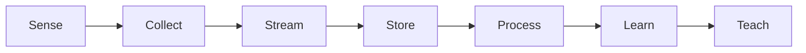
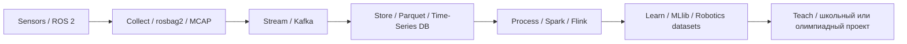

# Методы обработки больших данных

Учебные материалы по дисциплине **«Методы обработки больших данных»**.

**Направление подготовки:** 44.03.05 Педагогическое образование  
**Профиль:** «Информатика и дополнительное образование (робототехника)»  
**Среда выполнения практических работ:** Google Colab  
**Основной стек:** Python, PySpark, Apache Spark SQL, Structured Streaming, `rosbags`, MCAP, Spark MLlib

## Сквозная концепция курса

Курс рассматривает полный жизненный цикл данных робототехнических и IoT-систем: от получения сенсорных данных и потоковой передачи до распределённого хранения, аналитики, машинного обучения и педагогической адаптации инженерных задач.

---

## Содержание курса

### Раздел 1. Распределённое хранение и пакетная обработка больших данных

**Основные темы:** GFS/HDFS, MapReduce, Parquet/ORC, Apache Spark Core, RDD, DataFrame, Spark SQL, Catalyst Optimizer, Adaptive Query Execution, partitioning и shuffle.

- [Лекция 1. Распределённое хранение и пакетная обработка больших данных](2026/lectures/lecture_01_distributed_storage_batch.md)
- [Лабораторная работа № 1. Пакетная обработка данных в Apache Spark](2026/lw/lab_01/)
- [Лабораторная работа № 2. Parquet, партиционирование и бенчмаркинг](2026/lw/lab_02/)

### Раздел 2. Потоковые данные и распределённая обработка событий

**Основные темы:** Apache Kafka, KRaft, topic/partition/offset, consumer groups, Spark Structured Streaming, Apache Flink, Event Time, Processing Time, оконные функции, watermarking, checkpointing и exactly-once semantics.

- [Лекция 2. Потоковые данные и распределённая обработка событий](2026/lectures/lecture_02_stream_processing.md)
- [Лабораторная работа № 3. Spark Structured Streaming](2026/lw/lab_03/)

### Раздел 3. Большие данные робототехнических и IoT-систем

**Основные темы:** ROS 2, rosbag2, MCAP, CDR, IMU, LiDAR, одометрия, извлечение журналов без установленного ROS, Edge Computing, Time-Series СУБД, RMS, Z-score и обнаружение аномалий.

- [Лекция 3. Большие данные робототехнических и IoT-систем](2026/lectures/lecture_03_robotics_iot_big_data.md)
- [Лабораторная работа № 4. ROS 2 и MCAP без установленного ROS](2026/lw/lab_04/)
- [Лабораторная работа № 5. Временные ряды и обнаружение аномалий](2026/lw/lab_05/)

### Раздел 4. Масштабируемая аналитика, машинное обучение и образовательные проекты

**Основные темы:** Spark MLlib Pipelines, Transformers, Estimators, feature engineering, метрики качества, распределённое обучение, Open X-Embodiment, Hugging Face LeRobot, streaming datasets и педагогическая адаптация Big Data-проектов.

- [Лекция 4. Масштабируемая аналитика, машинное обучение и образовательные проекты](2026/lectures/lecture_04_scalable_ml_teach.md)
- [Лабораторная работа № 6. Spark MLlib и робототехнические датасеты](2026/lw/lab_06/)

Полные каталоги материалов:

- [Курс лекций](2026/lectures/)
- [Лабораторный практикум](2026/lw/)
- [Шаблон TEACH CARD](2026/lw/TEACH_CARD.md)
- [Зависимости для Google Colab](2026/lw/requirements-colab.txt)

---

## Лабораторный практикум

Все лабораторные работы выполняются в **Google Colab**. Каждая работа включает инженерную часть и педагогический компонент `TEACH CARD`, в котором студент адаптирует решённую задачу для школьного урока, кружка робототехники, НТО или хакатона.

| № | Лабораторная работа | Этапы pipeline | Максимум |
|---:|---|---|---:|
| 1 | Пакетная обработка логов робототехнических комплексов в Apache Spark | `Collect → Store → Process` | **10** |
| 2 | Колоночное хранение, партиционирование и бенчмаркинг Parquet | `Collect → Store → Process` | **10** |
| 3 | Потоковая обработка сенсорных событий в Spark Structured Streaming | `Stream → Process` | **10** |
| 4 | Извлечение и преобразование ROS 2 / MCAP без установленного ROS | `Sense → Collect → Store → Process` | **10** |
| 5 | Временные ряды телеметрии и обнаружение аномалий | `Store → Process → Learn` | **10** |
| 6 | Spark MLlib и исследование робототехнических датасетов | `Learn → Teach` | **10** |
|  | **Итого за лабораторные работы** |  | **60** |

Каждая лабораторная работа оценивается в **10 баллов**, включая **2 балла за корректно заполненную `TEACH CARD`**.

---

## Тестирование

Тестирование по дисциплине проводится на учебном портале:

**[https://envlab.ru/course/view.php?id=43](https://envlab.ru/course/view.php?id=43)**

Предусмотрены две контрольные точки:

| Контрольная точка | Тематика | Максимум |
|---|---|---:|
| **Тест 1** | Разделы 1–2: HDFS, Parquet, MapReduce, Spark, Spark SQL, Kafka, Structured Streaming, Flink, Event Time, Windows, Watermarking | **20** |
| **Тест 2** | Разделы 3–4: ROS 2, rosbag2, MCAP, сенсорные данные, Time-Series, аномалии, Spark MLlib, LeRobot, Open X-Embodiment, Teach | **20** |
|  | **Итого за тестирование** | **40** |

---

## Разбалловка дисциплины

Максимальная сумма — **100 баллов**.

| Вид учебной деятельности | Количество | Баллы за единицу | Максимум |
|---|---:|---:|---:|
| Лабораторные работы | 6 | 10 | **60** |
| Тест 1 по разделам 1–2 | 1 | 20 | **20** |
| Тест 2 по разделам 3–4 | 1 | 20 | **20** |
| **Итого** |  |  | **100** |

Итоговый балл:

$$B_{\mathrm{total}}=\sum_{i=1}^{6}B_{\mathrm{lab},i}+B_{\mathrm{test1}}+B_{\mathrm{test2}}.$$

---

## Организация работы

1. Изучить соответствующую лекцию.
2. Открыть Markdown-описание лабораторной работы.
3. Запустить предоставленный Jupyter Notebook в Google Colab.
4. Выполнить инженерную часть задания и получить воспроизводимый результат.
5. Заполнить `TEACH CARD` — педагогическую адаптацию инженерной задачи.
6. Представить результаты лабораторной работы в соответствии с требованиями преподавателя.
7. После завершения соответствующих разделов пройти тестирование на портале [envlab.ru](https://envlab.ru/course/view.php?id=43).

---

## Технологии курса

- Apache Spark / PySpark;
- Spark SQL и DataFrame API;
- Apache Parquet;
- Spark Structured Streaming;
- Apache Kafka и KRaft;
- Apache Flink;
- ROS 2, rosbag2, MCAP и CDR;
- `rosbags`, `mcap`, `mcap-ros2-support`;
- Pandas, PyArrow, NumPy, Plotly;
- Time-Series analytics;
- Spark MLlib;
- Hugging Face LeRobot;
- Open X-Embodiment.

---

## Сквозной результат обучения

По завершении курса студент должен уметь проектировать и объяснять полный data pipeline робототехнической системы:

Ключевой педагогический принцип курса: **инфраструктурная сложность при адаптации задачи может быть уменьшена, но инженерный и алгоритмический смысл должен сохраняться**.
